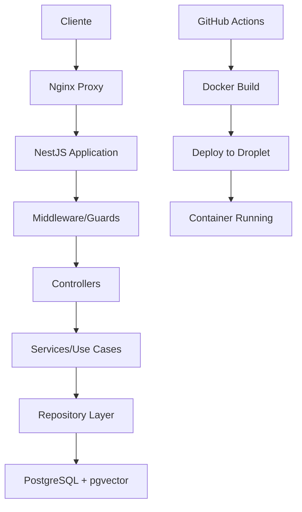

# Arquitectura Sofia Chat Backend v2

## Estructura General del Proyecto

### Organización de Carpetas

```
sofia-chat-backend-v2/
├── src/                    # Código fuente principal
│   ├── config/            # Configuraciones (DB, JWT, etc.)
│   ├── modules/           # Módulos funcionales (auth, organizations, etc.)
│   │   ├── core/          # CoreModule - servicios fundamentales compartidos
│   │   ├── hitl-types/    # Gestión de tipos HITL
│   │   ├── agent/         # Servicios de agentes
│   │   └── ...            # Otros módulos especializados
│   ├── common/            # Utilidades compartidas y decoradores
│   └── main.ts            # Punto de entrada de la aplicación
├── scripts/               # Scripts de automatización y configuración
├── docu/                  # Documentación de casos de uso y flujos
├── test/                  # Pruebas unitarias e integración
├── uploads/               # Archivos subidos por usuarios
├── logs/                  # Logs de la aplicación
└── infrastructure/        # Configuración Terraform (nuevo)
```

### Stack Tecnológico

- **Framework**: NestJS (Node.js)
- **Base de Datos**: PostgreSQL con pgvector
- **Autenticación**: JWT + Refresh Tokens
- **ORM**: TypeORM
- **Containerización**: Docker + Docker Compose
- **Proxy Reverso**: Nginx
- **SSL**: Let's Encrypt (Certbot)
- **CI/CD**: GitHub Actions
- **Infraestructura**: DigitalOcean Droplets

### Patrones Arquitecturales

1. **Modular por Dominio**: Cada funcionalidad en su propio módulo
2. **CoreModule Centralizado**: Servicios fundamentales compartidos sin dependencias circulares
3. **Inyección de Dependencias**: Uso de decoradores NestJS con arquitectura lineal
4. **Programación Funcional**: Preferencia por funciones puras
5. **Tipado Fuerte**: TypeScript con interfaces estrictas
6. **Casos de Uso**: Un hook/servicio por responsabilidad específica
7. **Separación de Responsabilidades**: Controladores, servicios y módulos con propósitos específicos

### Flujo de Datos Principal



### Responsabilidades por Capa

#### CoreModule
- **HitlTypesService**: Gestión de tipos HITL y asignaciones de usuarios
- **SystemEventsModule**: Logging y auditoría de eventos del sistema
- **NotificationModule**: Sistema de notificaciones unificado
- **AuthModule**: Autenticación y autorización base

#### Controllers
- **Endpoints API**: Definición de rutas y validación de entrada
- **Decoradores**: Aplicación de guards, validaciones y transformaciones
- **Respuestas HTTP**: Formateo de respuestas y manejo de errores

#### Services (Casos de Uso)
- **Lógica de Negocio**: Implementación de reglas y procesos específicos
- **Orquestación**: Coordinación entre diferentes servicios
- **Validaciones**: Verificación de datos y permisos de negocio

#### Repositories
- **Acceso a Datos**: Operaciones CRUD con TypeORM
- **Consultas Complejas**: Queries optimizadas y relaciones
- **Transacciones**: Manejo de consistencia de datos

#### Common
- **Decoradores**: Funcionalidades transversales reutilizables
- **Guards**: Validaciones de seguridad y autorización
- **Interceptors**: Transformación de requests/responses
- **Pipes**: Validación y transformación de datos

### Reglas de Desarrollo

- Archivos máximo 500 líneas
- Componentes máximo 30 líneas
- Un caso de uso por archivo
- No anidación de casos de uso
- Evitar `any`, usar tipado estricto
- Usar enums en lugar de union types de strings
- No queries dentro de ciclos
- Flujo lineal con inyección de dependencias
- **Dependencias**: Servicios compartidos en CoreModule, específicos en módulos especializados
- **Módulos**: Sin dependencias circulares, arquitectura unidireccional
- **Servicios**: Responsabilidad única, interfaces claras

#### Patrones de Implementación
- **CoreModule**: Servicios fundamentales (HitlTypes, SystemEvents, Notifications, Auth)
- **BaseAgent**: Lógica genérica compartida entre agentes
- **Servicios específicos**: Renderizado por proveedor (OpenAI, Claude)
- **FunctionCallService**: Ejecución centralizada de funciones con dependencias del CoreModule
- **Validaciones y logs**: Trazabilidad completa de ejecución
- **Arquitectura sin ciclos**: Dependencias unidireccionales hacia CoreModule

### Sistema de Permisos

#### Roles por Organización
- **OWNER**: Acceso completo a configuración y notificaciones
- **ADMIN**: Gestión operativa y notificaciones organizacionales
- **USER**: Acceso a funcionalidades básicas y notificaciones
- **HITL**: Especialista en intervención humana, notificaciones asignadas
- **Otros**: Acceso restringido según configuración
