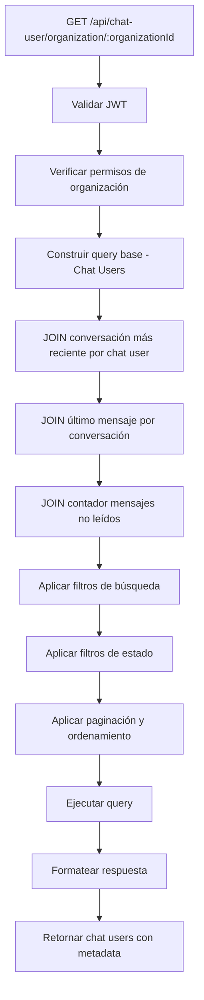

# Chat Users por Organización - Caso de Uso

## Qué hace
Endpoint que lista chat users (clientes) de una organización específica, mostrando cada cliente con información de su conversación más reciente para interfaces con scroll infinito.

## Flujo del Caso de Uso



## Componentes y Responsabilidades

### ChatUserController
- **Ruta**: `GET /api/chat-user/organization/:organizationId`
- **Guards**: JwtAuthGuard, JwtAuthRolesGuard
- **Roles**: HITL, OWNER, USER
- **Validación**: Params y query parameters con DTOs

### ChatUserService
- **Método**: `findChatUsersByOrganizationWithLastConversation()`
- **Validación**: Verificar pertenencia a organización
- **Query**: Construcción de query complejo con múltiples JOINs
- **Restricciones HITL**: Solo conversaciones asignadas

### ChatUsersOrganizationDto
- **Paginación**: page, limit (scroll infinito)
- **Búsqueda**: search (nombre, email, teléfono, secret)
- **Filtros estado**: status, needHuman, assignedToMe, hasUnreadMessages
- **Filtros conversación**: department, integrationType
- **Fechas**: dateFrom, dateTo (última actividad)
- **Ordenamiento**: sortBy, sortOrder

## Ubicación de Archivos

```
src/modules/chat-user/
├── chat-user.controller.ts          # Endpoint principal
├── chat-user.service.ts             # Lógica de negocio
├── chat-user.module.ts              # Configuración módulo
└── dto/
    └── chat-users-organization.dto.ts # DTOs y interfaces
```

## Estructura de Datos

### Request Query Parameters
```typescript
{
  page?: number;              // Paginación
  limit?: number;             // Elementos por página
  searchType?: 'id' | 'name'; // Tipo de búsqueda específica
  searchValue?: string;       // Valor a buscar (case-insensitive)
  department?: string;        // Filtro departamento
  integrationType?: IntegrationType; // Tipo integración
  status?: 'ia' | 'pendiente' | 'asignado'; // Estado conversación
  needHuman?: boolean;        // Necesita intervención
  assignedToMe?: boolean;     // Asignadas a usuario
  hasUnreadMessages?: boolean; // Con mensajes no leídos
  dateFrom?: string;          // Fecha inicio
  dateTo?: string;            // Fecha fin
  sortBy?: ChatUserSortBy;    // Campo ordenamiento
  sortOrder?: 'ASC' | 'DESC'; // Dirección orden
}
```

### Response Structure
```typescript
{
  ok: boolean;
  chat_users: Array<{
    chat_user_id: string;
    user_name: string;
    user_email: string;
    user_phone: string;
    avatar: string | null;
    secret: string;
    identifier: string;
    last_conversation: {
      conversation_id: number;
      last_message_text: string;
      last_message_created_at: string;
      last_message_type: MessageType;
      unread_messages: number;
      need_human: boolean;
      assigned_user_id: number | null;
      integration_type: string;
      department: string;
      last_activity: string;
      status: 'ia' | 'pendiente' | 'asignado';
    };
  }>;
  pagination: PaginationMeta;
  appliedFilters: Record<string, any>;
}
```

## Reglas de Negocio

### Permisos por Rol
- **HITL**: Solo ve chat users con conversaciones asignadas a él
- **OWNER/USER**: Ve todos los chat users de la organización

### Estados de Conversación  
- **ia**: need_human = false
- **pendiente**: need_human = true AND assigned_user_id = null
- **asignado**: need_human = true AND assigned_user_id != null

### Filtros y Búsqueda
- **searchType + searchValue**: Búsqueda específica por tipo
  - **id**: Busca por ID del chat user (coincidencia parcial)
  - **name**: Busca por nombre del chat user (case-insensitive, coincidencia parcial)
- **integrationType**: Se mapea automáticamente (whatsapp_manual → whatsapp)
- **department**: Filtro por nombre de departamento de conversación reciente
- **dateFrom/dateTo**: Filtro por fecha de última actividad

### Paginación
- **Scroll infinito**: Diseñado para cargar más elementos
- **Límites**: Máximo 100 elementos por página
- **Default**: 20 elementos por página

### Ordenamiento
- **last_activity**: Por fecha de conversación más reciente (default)
- **user_name**: Por nombre del chat user
- **unread_messages**: Por cantidad de mensajes no leídos
- **need_human**: Por necesidad de intervención
- **created_at**: Por fecha de creación del chat user

## Query SQL Optimizado

### Estrategia Principal
1. **Subquery**: Obtener conversación más reciente por chat user
2. **JOINs**: Último mensaje y contador de no leídos
3. **Filtros**: Aplicados tanto a chat user como a conversación
4. **Paginación**: LIMIT/OFFSET para scroll infinito

### Puntos Críticos de Performance
- **DISTINCT ON**: Para obtener una conversación por chat user
- **Índices**: En chatUserId, created_at, organizationId
- **Subqueries**: Optimizadas para evitar N+1 queries

## Casos de Uso Específicos

### Dashboard HITL
```
GET /api/chat-user/organization/13?status=pendiente&assignedToMe=false&sortBy=last_activity
```

### Búsqueda de Cliente por Nombre
```
GET /api/chat-user/organization/13?searchType=name&searchValue=juan&page=1&limit=10
```

### Búsqueda de Cliente por ID
```
GET /api/chat-user/organization/13?searchType=id&searchValue=123&page=1&limit=10
```

### Chat Users con Mensajes Pendientes
```
GET /api/chat-user/organization/13?hasUnreadMessages=true&sortBy=unread_messages&sortOrder=DESC
```

### Filtro por Canal
```
GET /api/chat-user/organization/13?integrationType=whatsapp&status=ia
```

### Scroll Infinito
```
GET /api/chat-user/organization/13?page=2&limit=20&sortBy=last_activity&sortOrder=DESC
```
