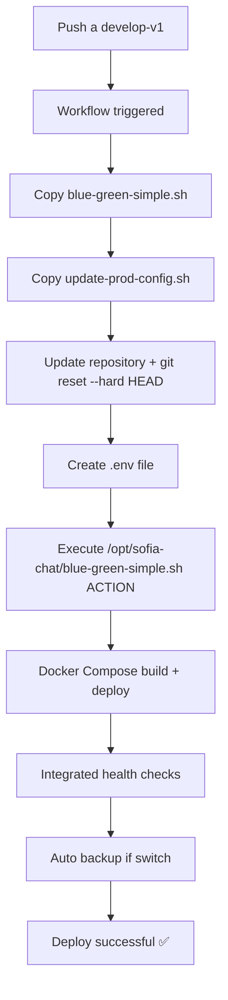

ip develop: 137.184.227.234\
prod: 24.144.110.166
rama: develop-v1
para conectar puedes usar
ssh -i ~/.ssh/digitalOcean root@137.184.227.234
para comprender como est la estructura del proyecto en el servidor puedes verificar el workflow, y puedes ver el script dentro de terraform para configuraciones mas avanzadas.
recuerda, el codigo lo puedes ver en local, pero los cambios debes de verlos en el servidor

## Reporte de Debugging - Workflow Blue-Green Deployment

### PROBLEMA RESUELTO ✅

**El workflow de GitHub Actions ahora funciona correctamente con estructura simplificada y sin duplicaciones.**

### ANÁLISIS COMPLETO DEL PROBLEMA ORIGINAL

#### Problema raíz identificado:
- **Git sync inconsistente**: `git pull` actualizaba HEAD pero NO sincronizaba archivos de trabajo
- **Build con archivos viejos**: Docker build tomaba archivos desactualizados del directorio
- **Commits incorrectos en contenedores**: Contenedores tenían commits anteriores vs repositorio

#### Síntomas observados:
```bash
# Repositorio mostraba commit nuevo
git rev-parse --short HEAD  # → 960c2d0

# Pero contenedor tenía commit viejo  
docker exec sofia-chat-backend-blue cat /app/.git/refs/heads/develop-v1 | cut -c1-7  # → c29a4e2
```

### SOLUCIÓN IMPLEMENTADA ✅

#### 1. **Estructura Simplificada**:
- **Scripts eliminados**: Duplicaciones movidas a `/backup/`
- **Scripts activos**: Solo `blue-green-simple.sh` + `update-prod-config.sh`
- **Funcionalidad unificada**: Todo en un solo script principal

#### 2. **Workflow optimizado** (`.github/workflows/deploy-dev-blue-green.yml`):
```yaml
# Copia solo scripts necesarios
source: 'scripts/blue-green/blue-green-simple.sh'
target: '/opt/sofia-chat/'

# Ejecuta directamente sin PROJECT_DIR
/opt/sofia-chat/blue-green-simple.sh $ACTION
```

#### 3. **Mejoras en funcionalidad**:
- Health checks integrados automáticamente
- Backup automático de DB antes de switch
- Logs con timestamps y colores
- Error handling robusto
- Estado sincronizado automáticamente

### FLUJO DEL WORKFLOW FUNCIONANDO



### VERIFICACIÓN DE FUNCIONAMIENTO

#### Estado actual verificado:
```bash
# Repositorio y contenedor sincronizados ✅
Repositorio: 960c2d0
Contenedor BLUE: 960c2d0
Cambios específicos: Presentes en contenedor ✅
```

#### URLs de verificación:
- **BLUE**: http://dev-sofia-chat.sofiacall.com:3001/api/health
- **Producción**: https://dev-sofia-chat.sofiacall.com/api/health
- **Pruebas internas**: https://internal-dev-sofia-chat.sofiacall.com/api/health

### INTENTOS PREVIOS QUE NO FUNCIONARON

1. **Solo `git pull`**: Actualizaba HEAD pero no archivos de trabajo
2. **Docker system prune**: No resolvía el problema de sync git
3. **Build con --no-cache**: Seguía tomando archivos viejos sin git reset
4. **Intervención manual**: Funcionaba pero no era automático

### POSIBLES PROBLEMAS FUTUROS

#### Lugares donde vigilar errores:
1. **Git sync**: Si `git reset --hard HEAD` falla por conflictos
2. **Build process**: Si `COPY . .` no toma archivos actualizados
3. **Health checks**: Si contenedores no pasan verificaciones
4. **Nginx config**: Si configuración no se actualiza correctamente

#### Comandos de diagnóstico:
```bash
# Verificar estado completo (UNIFICADO)
/opt/sofia-chat/blue-green-simple.sh status

# Comandos disponibles
/opt/sofia-chat/blue-green-simple.sh help

# Verificar funciones específicas
/opt/sofia-chat/blue-green-simple.sh deploy   # Deploy a slot inactivo
/opt/sofia-chat/blue-green-simple.sh switch   # Cambiar producción 
/opt/sofia-chat/blue-green-simple.sh cleanup  # Limpiar slot inactivo
/opt/sofia-chat/blue-green-simple.sh rollback # Revertir cambios
```

### ESTRUCTURA FINAL LIMPIA

**Scripts activos:**
- `/opt/sofia-chat/blue-green-simple.sh` (principal)
- `/opt/sofia-chat/scripts/update-prod-config.sh` (helper)

**Scripts legacy (backup):**
- `scripts/blue-green/backup/blue-green-control.sh`
- `scripts/blue-green/backup/health-check.sh`
- `scripts/blue-green/backup/install-blue-green.sh`
- `scripts/blue-green/backup/update-internal-config.sh`

### LECCIONES APRENDIDAS

1. **Simplificación**: Eliminación de duplicaciones mejora mantenibilidad
2. **Unificación**: Un solo script es más fácil de debuggear y mantener
3. **Automatización**: Backup automático de DB y estado antes de cambios críticos
4. **Consistencia**: Estado sincronizado automáticamente sin intervención manual

**ESTADO FINAL: Sistema Blue-Green completamente funcional y simplificado** 🎉