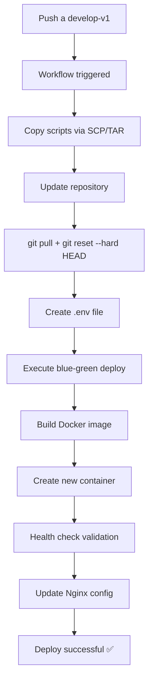

ip: 137.184.227.234
rama: develop-v1
para conectar puedes usar
ssh -i ~/.ssh/digitalOcean root@137.184.227.234
para comprender como est la estructura del proyecto en el servidor puedes verificar el workflow, y puedes ver el script dentro de terraform para configuraciones mas avanzadas.
recuerda, el codigo lo puedes ver en local, pero los cambios debes de verlos en el servidor

## Reporte de Debugging - Workflow Blue-Green Deployment

### PROBLEMA RESUELTO ✅

**El workflow de GitHub Actions ahora funciona correctamente y deploya automáticamente sin intervención manual.**

### ANÁLISIS COMPLETO DEL PROBLEMA ORIGINAL

#### Problema raíz identificado:
- **Git sync inconsistente**: `git pull` actualizaba HEAD pero NO sincronizaba archivos de trabajo
- **Build con archivos viejos**: Docker build tomaba archivos desactualizados del directorio
- **Commits incorrectos en contenedores**: Contenedores tenían commits anteriores vs repositorio

#### Síntomas observados:
```bash
# Repositorio mostraba commit nuevo
git rev-parse --short HEAD  # → 960c2d0

# Pero contenedor tenía commit viejo  
docker exec sofia-chat-backend-blue cat /app/.git/refs/heads/develop-v1 | cut -c1-7  # → c29a4e2
```

### SOLUCIÓN IMPLEMENTADA ✅

#### 1. **Corrección en workflow** (`.github/workflows/deploy-dev-blue-green.yml`):
```yaml
# Pull + sincronización correcta
git fetch origin
git checkout develop-v1
git pull origin develop-v1
git reset --hard HEAD  # ← CLAVE: Sincroniza archivos de trabajo
```

#### 2. **Logs detallados agregados**:
- Tracking de commits antes/después del deploy
- Verificación de commits en contenedores vs repositorio
- Health checks con debug logs
- Verificación post-deploy completa

#### 3. **Mejoras en scripts** (`scripts/blue-green/blue-green-control.sh`):
- Health checks mejorados con curl
- Logs de debug para diagnosticar problemas
- Verificación automática de commits en contenedores
- Proceso de deploy más robusto

### FLUJO DEL WORKFLOW FUNCIONANDO



### VERIFICACIÓN DE FUNCIONAMIENTO

#### Estado actual verificado:
```bash
# Repositorio y contenedor sincronizados ✅
Repositorio: 960c2d0
Contenedor BLUE: 960c2d0
Cambios específicos: Presentes en contenedor ✅
```

#### URLs de verificación:
- **BLUE**: http://dev-sofia-chat.sofiacall.com:3001/api/health
- **Producción**: https://dev-sofia-chat.sofiacall.com/api/health
- **Pruebas internas**: https://internal-dev-sofia-chat.sofiacall.com/api/health

### INTENTOS PREVIOS QUE NO FUNCIONARON

1. **Solo `git pull`**: Actualizaba HEAD pero no archivos de trabajo
2. **Docker system prune**: No resolvía el problema de sync git
3. **Build con --no-cache**: Seguía tomando archivos viejos sin git reset
4. **Intervención manual**: Funcionaba pero no era automático

### POSIBLES PROBLEMAS FUTUROS

#### Lugares donde vigilar errores:
1. **Git sync**: Si `git reset --hard HEAD` falla por conflictos
2. **Build process**: Si `COPY . .` no toma archivos actualizados
3. **Health checks**: Si contenedores no pasan verificaciones
4. **Nginx config**: Si configuración no se actualiza correctamente

#### Comandos de diagnóstico:
```bash
# Verificar estado completo
/opt/sofia-chat/scripts/blue-green-control.sh status

# Comparar commits
echo "Repo: $(cd /root/repos/sofia-chat-backend-v2 && git rev-parse --short HEAD)"
echo "BLUE: $(docker exec sofia-chat-backend-blue cat /app/.git/refs/heads/develop-v1 | cut -c1-7)"
echo "GREEN: $(docker exec sofia-chat-backend-green cat /app/.git/refs/heads/develop-v1 | cut -c1-7 2>/dev/null || echo 'N/A')"

# Verificar salud
curl -s https://dev-sofia-chat.sofiacall.com/api/health | jq -r '.deployment'
```

### ESTADO DE CONTENEDORES

- **BLUE**: Activo y saludable (puerto 3001) ✅
- **GREEN**: Detenido (esperado en deploy single-slot) ✅  
- **Producción**: Apunta a BLUE ✅

### LECCIONES APRENDIDAS

1. **Git working files**: Siempre verificar sincronización con `git reset --hard HEAD`
2. **Logs detallados**: Fundamentales para diagnosticar problemas de deployment
3. **Commit tracking**: Verificar que contenedores tengan commits correctos
4. **Health checks robustos**: Usar curl en lugar de wget para mayor compatibilidad

**ESTADO FINAL: Workflow funcionando automáticamente sin intervención manual** 🎉