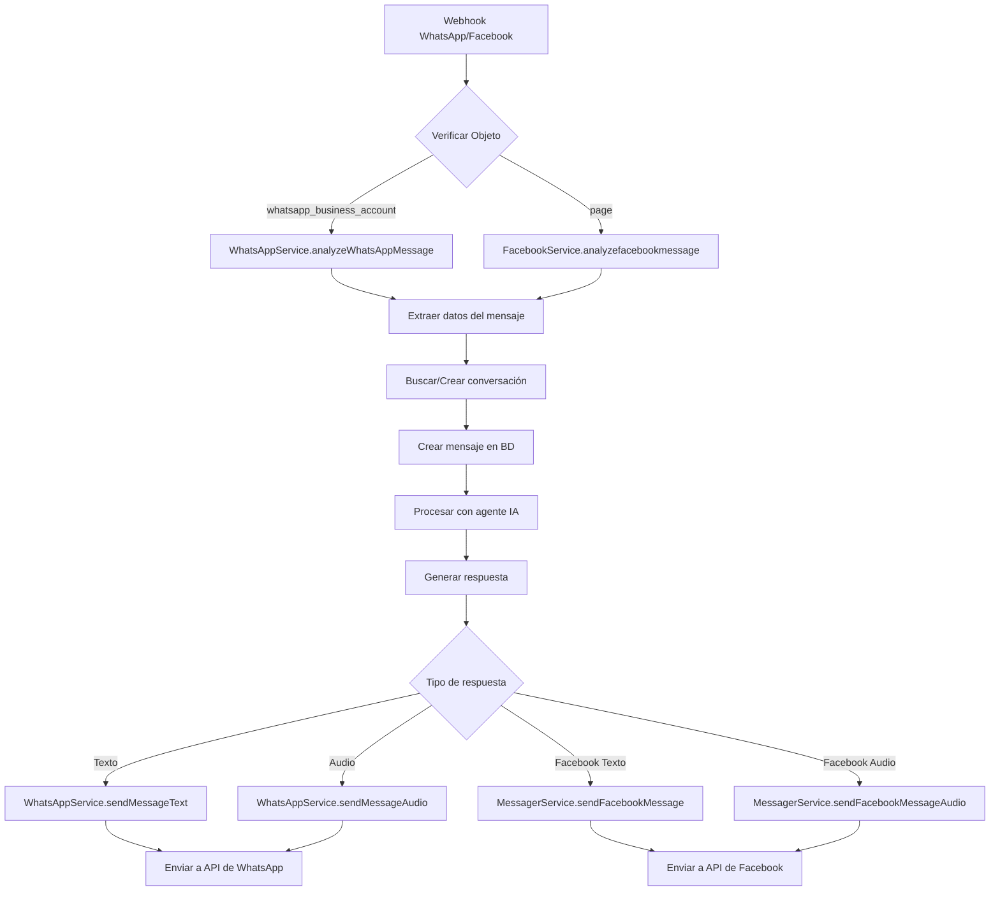

# Facebook y WhatsApp Integration Use Case

## Qué hace
Procesa mensajes entrantes de WhatsApp y Facebook Messenger mediante webhooks, los convierte en conversaciones y genera respuestas automáticas usando agentes IA.

## Diagrama de Flujo



## Componentes y Responsabilidades

### Controllers
- **FacebookController** (`src/modules/facebook/facebook.controller.ts`)
  - `GET /webhook` - Verificación de webhook
  - `POST /webhook` - Recepción de mensajes
  - `GET /webhook/:integrationId` - Verificación manual por integración
  - `POST /webhook/:integrationId` - Mensajes por integración específica

### Services
- **FacebookService** (`src/modules/facebook/facebook.service.ts`)
  - `analyzeWhatsAppMessage()` - Procesa mensajes de WhatsApp
  - `analyzefacebookmessage()` - Procesa mensajes de Facebook
  - `createIntegrationWhatsApp()` - Crea integración WhatsApp
  - `createIntegrationMessager()` - Crea integración Facebook

- **WhatsAppService** (`src/modules/facebook/whatsapp.service.ts`)
  - `sendMessage()` - Dispatcher de envío
  - `sendMessageText()` - Envío de mensajes de texto
  - `sendMessageAudio()` - Envío de mensajes de audio

- **MessagerService** (`src/modules/facebook/messager.service.ts`)
  - `sendFacebookMessage()` - Envío de mensajes de texto
  - `sendFacebookMessageAudio()` - Envío de mensajes de audio

## Ubicación de Archivos

### Código Principal
```
src/modules/facebook/
├── facebook.controller.ts      # Endpoints webhook y gestión
├── facebook.service.ts         # Lógica de procesamiento
├── whatsapp.service.ts        # Servicio WhatsApp
├── messager.service.ts        # Servicio Facebook Messenger
├── facebook.module.ts         # Módulo principal
└── dto/
    ├── webhook-facebook.dto.ts # Validación webhooks
    ├── create-integration-whats-app.dto.ts
    └── create-integration-messager.dto.ts
```

### Archivos de Prueba
```
test/
├── whatsapp/
│   └── webhook_whatsapp_example.json
└── facebook/
    └── webhook_facebook_example.json
```

## Estructura de Datos

### Webhook WhatsApp
```typescript
{
  object: "whatsapp_business_account",
  entry: [{
    id: string,
    changes: [{
      value: {
        messaging_product: "whatsapp",
        metadata: {
          display_phone_number: string,
          phone_number_id: string
        },
        messages: [{
          from: string,
          id: string,
          timestamp: string,
          text: { body: string },
          type: "text" | "audio"
        }]
      }
    }]
  }]
}
```

### Webhook Facebook
```typescript
{
  object: "page",
  entry: [{
    id: string,
    time: number,
    messaging: [{
      sender: { id: string },
      recipient: { id: string },
      timestamp: number,
      message: {
        mid: string,
        text: string
      }
    }]
  }]
}
```

### Configuración de Integración
```typescript
// WhatsApp
{
  name: string,
  token: string,
  phoneNumberId: string,
  displayPhoneNumber: string
}

// Facebook
{
  name: string,
  pageId: string,
  pageAccessToken: string
}
```

## Reglas de Negocio

### Verificación de Webhook
- Token debe coincidir con `FACEBOOK_WEBHOOK_SECRET`
- Modo debe ser `subscribe`
- Respuesta debe ser el valor de `hub.challenge`

### Procesamiento de Mensajes
- Solo procesar mensajes con campo `messages` presente
- Crear conversación si no existe basada en sender ID
- Generar respuesta automática usando agente configurado
- Mantener formato de mensaje (texto/audio)

### Envío de Respuestas
- WhatsApp: usar Graph API v21.0 con token de integración
- Facebook: usar Graph API v21.0 con page access token
- Audio: subir a servidor y enviar link público
- Manejo de errores con logging detallado

### Configuración de URLs
- Webhook principal: `/api/facebook/webhook`
- Webhook por integración: `/api/facebook/webhook/:integrationId`
- URL audio público: `URL_WEB_HOOK_WHATSAPP/audio/filename`
- Graph API: `https://graph.facebook.com/v21.0`
