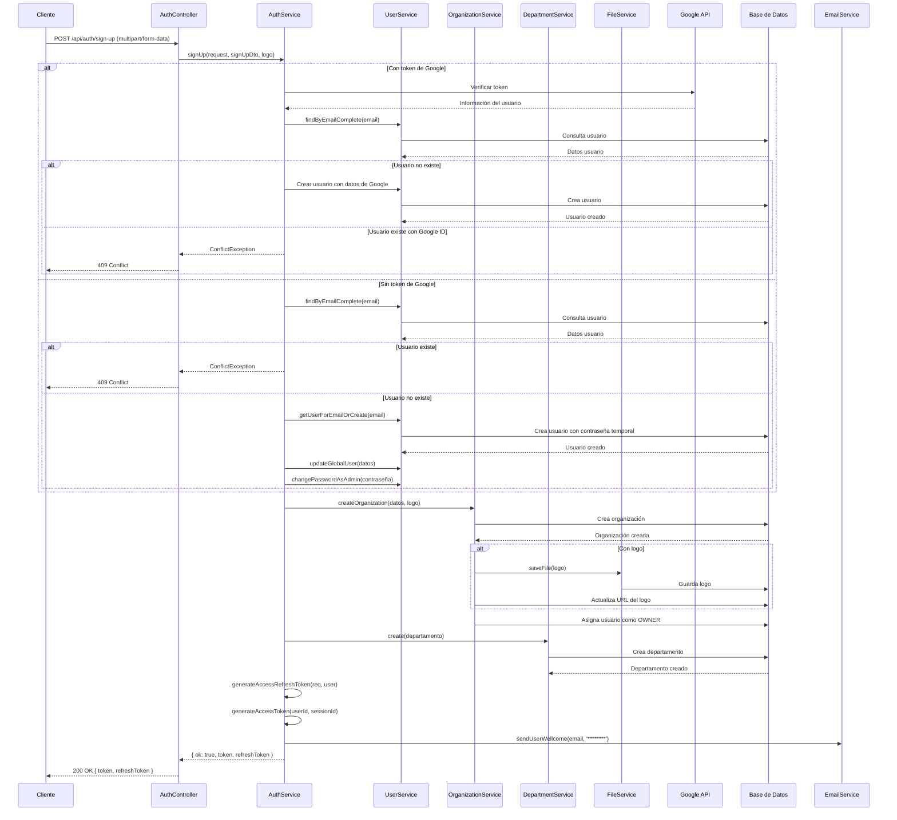

# Flujo de Autenticación

Este documento describe los diferentes flujos de autenticación implementados en el backend de Converxa Chat.

## Flujo de Autenticación con Email y Contraseña

## Flujo de Autenticación con Google

## Flujo de Refresco de Token

## Flujo de Cierre de Sesión

## Flujo de Registro (Sign Up)

## Integración con el Sistema Existente

La implementación de la autenticación con Google se integra perfectamente con el sistema de autenticación existente:

1. **Tokens JWT**: Tanto la autenticación con email/contraseña como la autenticación con Google utilizan el mismo sistema de tokens JWT para mantener la sesión del usuario.

2. **Sesiones**: Ambos métodos de autenticación crean sesiones en la base de datos, lo que permite al usuario gestionar sus sesiones activas.

3. **Perfil de Usuario**: La información del perfil de Google (nombre, imagen) se almacena en el perfil del usuario, enriqueciendo la información disponible.

4. **Verificación de Email**: Los usuarios que se autentican con Google tienen su email marcado automáticamente como verificado, ya que Google ya ha verificado su identidad.

5. **Jerarquía de Autenticación**: La autenticación con Google tiene prioridad sobre la autenticación con contraseña. Si un usuario ya tiene una cuenta con Google, no podrá registrarse con contraseña usando el mismo email.

6. **Registro Completo**: El proceso de registro incluye la creación de una organización y un departamento, asignando al usuario como propietario (OWNER) de la organización.

Esta integración permite a los usuarios utilizar cualquiera de los métodos de autenticación de forma intercambiable, mejorando la experiencia de usuario y facilitando el acceso a la plataforma.
