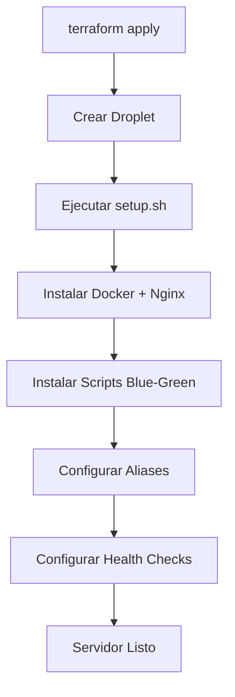
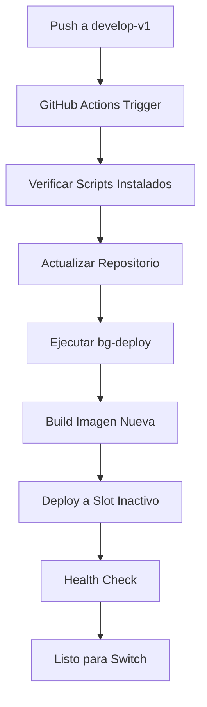
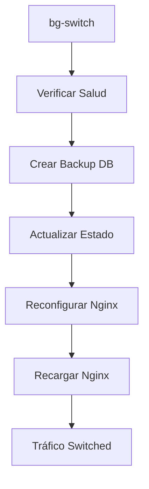

# Flujo Blue-Green Deployment Automatizado

## Descripción General

Este documento describe el flujo completamente automatizado de Blue-Green deployment para Converxa Chat Backend, donde los scripts se instalan automáticamente durante la creación del servidor via Terraform, eliminando la necesidad de copiarlos manualmente.

## 🏗️ Arquitectura del Sistema

### Componentes Automatizados

1. **Terraform Setup**: Instala automáticamente scripts Blue-Green durante la creación del servidor
2. **Scripts Permanentes**: Ubicados en `/opt/converxa-chat/` y listos desde el primer arranque
3. **Workflow Optimizado**: Solo ejecuta comandos, no copia archivos
4. **Makefile Local**: Facilita operaciones desde máquina local

### Estructura de Archivos

```
/opt/converxa-chat/
├── blue-green-simple.sh           # Script principal
├── scripts/
│   ├── update-prod-config.sh      # Actualización de Nginx
│   └── health-check.sh            # Monitoreo automático
└── .blue-green-state              # Estado actual del sistema
```

## 🔄 Flujo Automatizado

### 1. Inicialización del Servidor (Una sola vez)



**Lo que instala automáticamente:**
- Scripts Blue-Green en `/opt/converxa-chat/`
- Configuración inicial de Nginx para Blue (puerto 3002)
- Aliases: `bg-status`, `bg-deploy`, `bg-switch`, etc.
- Health checks automáticos cada 5 minutos
- Logrotate para logs de Blue-Green

### 2. Proceso de Deployment



### 3. Switch de Tráfico



## 🚀 Comandos Disponibles

### En el Servidor (via SSH)

```bash
# Ver estado actual
bg-status

# Desplegar a slot inactivo
bg-deploy

# Cambiar tráfico
bg-switch

# Rollback
bg-rollback

# Limpiar slot inactivo
bg-cleanup

# Ver logs
bg-logs converxa-chat-backend-blue
```

### Desde Local (via Makefile)

```bash
# Ver estado
make status

# Desplegar nueva versión
make deploy

# Cambiar tráfico (con confirmación)
make switch

# Rollback (con confirmación)
make rollback

# Ver salud de contenedores
make health

# Probar endpoints
make test-endpoints

# Conectar al servidor
make connect
```

## 📋 Estados del Sistema

### Estado Blue (Inicial)
```
Producción: Blue (puerto 3002) ← Tráfico de usuarios
Staging: Green (puerto 3003)   ← Disponible para deploy
```

### Después del Deploy
```
Producción: Blue (puerto 3002) ← Tráfico de usuarios
Staging: Green (puerto 3003)   ← Nueva versión desplegada
```

### Después del Switch
```
Producción: Green (puerto 3003) ← Tráfico de usuarios
Staging: Blue (puerto 3002)     ← Versión anterior (rollback)
```

## 🔧 Configuración Automática

### Nginx Dinámico

El script `update-prod-config.sh` mantiene dos configuraciones:

1. **Producción**: `back-chat.converxa.net` → Puerto activo
2. **Testing Interno**: `internal-back-chat.converxa.net` → Puerto inactivo

### Health Checks Automáticos

- **Frecuencia**: Cada 5 minutos via cron
- **Log**: `/var/log/converxa-chat/health-check.log`
- **Alertas**: Automáticas si producción no está saludable

### Backup Automático

Antes de cada switch:
- Estado actual del sistema
- Backup completo de base de datos
- Información de contenedores activos

## 🛠️ Instalación Initial (Solo una vez)

### Paso 1: Aplicar Terraform

```bash
cd infrastructure/
terraform init
terraform apply
```

**Lo que hace:**
- Crea el droplet
- Instala todas las dependencias
- Configura scripts Blue-Green
- Establece configuración inicial

### Paso 2: Configurar DNS (Manual)

```bash
# Configurar registros DNS
internal-back-chat.converxa.net → IP_DEL_SERVIDOR
```

### Paso 3: Obtener Certificados SSL

```bash
# En el servidor (via SSH)
certbot --nginx -d internal-back-chat.converxa.net --non-interactive --agree-tos --email admin@converxa.net
```

### Paso 4: Primer Deployment

```bash
# Desde local
make deploy
make health
make switch  # Con confirmación
```

## 📖 Flujo de Trabajo Diario

### Desarrollo Normal

```bash
# 1. Hacer cambios en código
git add .
git commit -m "Feature: nueva funcionalidad"
git push origin develop-v1

# 2. GitHub Actions deploys automáticamente
# (No requiere intervención)

# 3. Verificar deployment
make health

# 4. Cambiar tráfico cuando esté listo
make switch
```

### En Caso de Problemas

```bash
# Rollback inmediato
make rollback

# Ver logs para debugging
make logs

# Conectar al servidor para investigar
make connect
```

## 🔍 Monitoreo y Debugging

### Logs Importantes

```bash
# Health checks
tail -f /var/log/converxa-chat/health-check.log

# Logs de aplicación
docker logs -f converxa-chat-backend-blue
docker logs -f converxa-chat-backend-green

# Logs de Nginx
tail -f /var/log/nginx/error.log
```

### Diagnóstico Rápido

```bash
# Estado completo del sistema
make debug-status

# Información del servidor
make info

# Probar todos los endpoints
make test-endpoints
```

## ⚡ Ventajas del Nuevo Flujo

### Vs. Flujo Manual Anterior

| Aspecto | Anterior | Nuevo |
|---------|----------|--------|
| **Scripts** | Copia manual cada vez | Instalados permanentemente |
| **Configuración** | Manual post-deploy | Automática via Terraform |
| **Workflow** | Copia archivos innecesarios | Solo ejecuta comandos |
| **Operación** | SSH requerido | Makefile desde local |
| **Confiabilidad** | Propenso a errores | Completamente automatizado |
| **Velocidad** | ~3-5 minutos | ~1-2 minutos |

### Beneficios Adicionales

- ✅ **Zero Setup**: Servidor listo desde creación
- ✅ **Rollback Rápido**: Un comando desde local
- ✅ **Backup Automático**: Base de datos y estado
- ✅ **Health Monitoring**: Automático cada 5 minutos
- ✅ **Error Recovery**: Comandos de emergencia
- ✅ **Developer Friendly**: Makefile con confirmaciones

## 🚨 Comandos de Emergencia

### Restaurar Configuración Básica

```bash
# Desde local
make emergency-restore
```

### Forzar Recreación Completa

```bash
# Solo en casos extremos
make force-rebuild
```

### Acceso Manual al Servidor

```bash
# Conectar directamente
make connect

# O manualmente
ssh -i ~/.ssh/digitalOcean root@137.184.44.230
```

## 📚 Referencias

- **Scripts Source**: `infrastructure/modules/droplet/setup.sh`
- **Workflow**: `.github/workflows/deploy-dev-blue-green.yml`
- **Makefile**: `Makefile`
- **Documentación Técnica**: `docs/flujo-blue-green-deployment.md`

## 🎯 Próximos Pasos

1. **Monitoreo Avanzado**: Integrar con alertas externas
2. **Métricas**: Dashboard de performance
3. **Multi-Environment**: Extender a staging/production
4. **Auto-Rollback**: Rollback automático en fallos críticos

---

**¡Blue-Green Deployment completamente automatizado y listo para uso! 🚀**