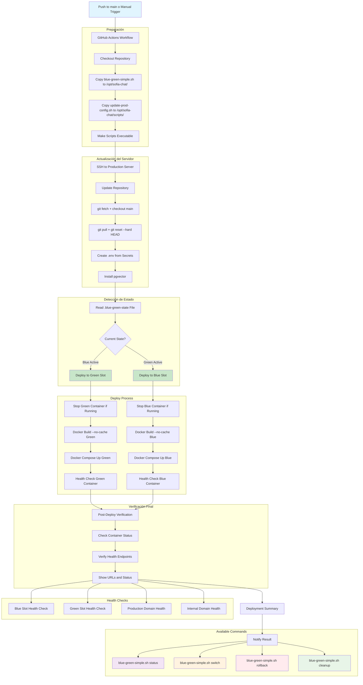

# Flujo Blue-Green Deployment

## Descripción General

Sistema de despliegue Blue-Green que permite desplegar nuevas versiones del backend sin tiempo de inactividad, con capacidad de pruebas internas y rollback inmediato.

## Entornos Disponibles

### Desarrollo (DEV)
- **Rama**: `develop-v1`
- **Workflow**: `deploy-dev-blue-green.yml`
- **Docker Compose**: `docker-compose.yml`
- **Puertos**: Blue=3001, Green=3002
- **Dominios**: `dev-sofia-chat.sofiacall.com`, `internal-dev-sofia-chat.sofiacall.com`

### Producción (PROD)
- **Rama**: `main`
- **Workflow**: `deploy-development.yaml`
- **Docker Compose**: `docker-compose.prod.yml`
- **Puertos**: Blue=3002, Green=3003
- **Dominios**: `sofia-chat.sofiacall.com`

## Componentes Involucrados

### Infraestructura
- **Nginx**: Proxy reverso con configuración de upstreams dinámicos
- **Docker Containers**: sofia-chat-backend-blue y sofia-chat-backend-green
- **PostgreSQL**: Base de datos compartida entre ambos entornos
- **GitHub Actions**: Automatización de build y deploy

### Dominios
- **Producción**: `temp-sofia-chat.sofiacall.com` → Apunta al entorno activo
- **Pruebas Internas**: `internal-temp-sofia-chat.sofiacall.com` → Apunta al entorno activo

### Configuración de Puertos por Entorno

#### Desarrollo (DEV)
- **Blue Container**: `sofia-chat-backend-blue`
  - Puerto externo: `3001` (host)
  - Puerto interno: `3001` (container)
  - Mapeo: `3001:3001`
  - Health check: `http://127.0.0.1:3001/api/health`

- **Green Container**: `sofia-chat-backend-green`
  - Puerto externo: `3002` (host)
  - Puerto interno: `3001` (container)
  - Mapeo: `3002:3001`
  - Health check: `http://127.0.0.1:3001/api/health`

#### Producción (PROD)
- **Blue Container**: `sofia-chat-backend-blue`
  - Puerto externo: `3002` (host)
  - Puerto interno: `3001` (container)
  - Mapeo: `3002:3001`
  - Health check: `http://127.0.0.1:3001/api/health`

- **Green Container**: `sofia-chat-backend-green`
  - Puerto externo: `3003` (host)
  - Puerto interno: `3001` (container)
  - Mapeo: `3003:3001`
  - Health check: `http://127.0.0.1:3001/api/health`

#### Tabla de Referencia de Puertos

| Entorno | Container | Puerto Host | Puerto Container | Health Check Externo | Health Check Interno |
|---------|-----------|-------------|------------------|---------------------|---------------------|
| **DEV Blue** | sofia-chat-backend-blue | 3001 | 3001 | `localhost:3001/api/health` | `127.0.0.1:3001/api/health` |
| **DEV Green** | sofia-chat-backend-green | 3002 | 3001 | `localhost:3002/api/health` | `127.0.0.1:3001/api/health` |
| **PROD Blue** | sofia-chat-backend-blue | 3002 | 3001 | `localhost:3002/api/health` | `127.0.0.1:3001/api/health` |
| **PROD Green** | sofia-chat-backend-green | 3003 | 3001 | `localhost:3003/api/health` | `127.0.0.1:3001/api/health` |

#### Configuración de Nginx por Entorno
**Desarrollo:**
- **Estado Blue Activo**: Nginx → `localhost:3001` (blue container)
- **Estado Green Activo**: Nginx → `localhost:3002` (green container)

**Producción:**
- **Estado Blue Activo**: Nginx → `localhost:3002` (blue container)
- **Estado Green Activo**: Nginx → `localhost:3003` (green container)

### Scripts de Control
- **`blue-green-simple.sh`**: Script principal unificado para gestionar todo el ciclo
- **`update-prod-config.sh`**: Script helper para actualizar configuración de Nginx

## Flujo de Despliegue



## Estados del Sistema

### Estados del Sistema - Desarrollo

#### Estado Inicial
- **Blue**: Activo en producción (puerto 3001)
- **Green**: Inactivo
- **Nginx**: → localhost:3001 (blue)

#### Después del Deploy
- **Blue**: Activo en producción (puerto 3001)
- **Green**: Nuevo código en pruebas (puerto 3002)
- **Nginx**: → localhost:3001 (blue)
- **Estado**: Permanece en "blue"

#### Después del Switch
- **Blue**: Código anterior en standby (puerto 3001)
- **Green**: Activo en producción (puerto 3002)
- **Nginx**: → localhost:3002 (green)
- **Estado**: Cambia a "green"

### Estados del Sistema - Producción

#### Estado Inicial
- **Blue**: Activo en producción (puerto 3002)
- **Green**: Inactivo
- **Nginx**: → localhost:3002 (blue)

#### Después del Deploy
- **Blue**: Activo en producción (puerto 3002)
- **Green**: Nuevo código en pruebas (puerto 3003)
- **Nginx**: → localhost:3002 (blue)
- **Estado**: Permanece en "blue"

#### Después del Switch
- **Blue**: Código anterior en standby (puerto 3002)
- **Green**: Activo en producción (puerto 3003)
- **Nginx**: → localhost:3003 (green)
- **Estado**: Cambia a "green"

### Comandos de Control

### Detectar Estado Actual
```bash
/opt/sofia-chat/blue-green-simple.sh status
```

### Deploy Automático
```bash
# Manual o vía Workflow
/opt/sofia-chat/blue-green-simple.sh deploy
```

### Cambiar Tráfico a Nuevo Deploy
```bash
/opt/sofia-chat/blue-green-simple.sh switch
```

### Rollback al Estado Anterior
```bash
/opt/sofia-chat/blue-green-simple.sh rollback
```

### Limpiar Contenedor de Pruebas (Inactivo)
```bash
/opt/sofia-chat/blue-green-simple.sh cleanup
```

### Restaurar Base de Datos
```bash
/opt/sofia-chat/blue-green-simple.sh restore
```

## Configuración Nginx

### Upstreams Dinámicos
```nginx
upstream backend_prod {
    server 127.0.0.1:3001;  # Cambia dinámicamente
}

upstream backend_internal {
    server 127.0.0.1:3002;  # Cambia dinámicamente
}
```

### Configuración de Dominios
- Producción usa `backend_prod` upstream
- Pruebas internas usa `backend_internal` upstream
- Scripts modifican archivos de configuración y recargan Nginx

## Estructura de Scripts Simplificada

### Scripts Activos
Solo **2 scripts** son necesarios para el funcionamiento completo:

- **`blue-green-simple.sh`** - Script principal con todas las funcionalidades
- **`update-prod-config.sh`** - Helper para actualizar configuración de Nginx

### Scripts Movidos a Backup
Para evitar duplicaciones, los siguientes scripts se movieron a `scripts/blue-green/backup/`:

- `blue-green-control.sh` - Funcionalidad duplicada
- `update-internal-config.sh` - No usado por el script principal
- `health-check.sh` - Funcionalidad integrada en el principal
- `install-blue-green.sh` - Solo para setup inicial

### Sincronización Manual
```bash
# Copiar scripts necesarios desde el repositorio
scp -i ~/.ssh/digitalOcean scripts/blue-green/blue-green-simple.sh root@IP:/opt/sofia-chat/
scp -i ~/.ssh/digitalOcean scripts/blue-green/update-prod-config.sh root@IP:/opt/sofia-chat/scripts/

# Hacer ejecutables
ssh -i ~/.ssh/digitalOcean root@IP "chmod +x /opt/sofia-chat/blue-green-simple.sh /opt/sofia-chat/scripts/update-prod-config.sh"

# Verificar funcionamiento
ssh -i ~/.ssh/digitalOcean root@IP "/opt/sofia-chat/blue-green-simple.sh status"
```

## Consideraciones de Seguridad

### Base de Datos Compartida
- Migraciones deben ser backward-compatible
- Validar esquema antes del switch
- Rollback de DB si es necesario

### Certificados SSL
- Ambos dominios deben tener certificados válidos
- Renovación automática configurada

### Monitoreo
- Health checks continuos en ambos entornos
- Logs separados por color (blue/green)
- Métricas de rendimiento comparativas

## Flujo de Rollback


## Integración con CI/CD

### GitHub Actions
1. **Copy Scripts**: Transferir `blue-green-simple.sh` y `update-prod-config.sh` via SCP
2. **Update Repository**: git pull + git reset --hard HEAD
3. **Execute Action**: Ejecutar `blue-green-simple.sh` con la acción solicitada
4. **Status Display**: Mostrar estado final del deployment
5. **Health Check**: Verificar conectividad básica de endpoints
6. **Manual Actions**: Switch, rollback y cleanup se ejecutan manualmente

### Configuración del Script
El script usa configuración embebida en lugar de variables de entorno:

- **`PROJECT_DIR`**: `/root/repos/sofia-chat-backend-v2`
- **`STATE_FILE`**: `/opt/.blue-green-state`
- **`DOCKER_COMPOSE`**: `docker-compose -f docker-compose.yml`

### Funcionalidades Incluidas
- ✅ Deploy automático con Docker Compose
- ✅ Switch con backup automático de DB
- ✅ Health checks integrados
- ✅ Cleanup con liberación de espacio
- ✅ Rollback con restauración de estado
- ✅ Logs detallados con timestamps

## Monitoreo y Alertas

### Health Endpoints por Entorno

#### Desarrollo
- **Blue**: `http://localhost:3001/api/health` (externo)
- **Green**: `http://localhost:3002/api/health` (externo)
- **Interno**: Ambos containers usan `http://127.0.0.1:3001/api/health`

```bash
# Verificación externa DEV
curl -sf http://localhost:3001/api/health  # Blue container
curl -sf http://localhost:3002/api/health  # Green container
```

#### Producción
- **Blue**: `http://localhost:3002/api/health` (externo)
- **Green**: `http://localhost:3003/api/health` (externo)
- **Interno**: Ambos containers usan `http://127.0.0.1:3001/api/health`

```bash
# Verificación externa PROD
curl -sf http://localhost:3002/api/health  # Blue container
curl -sf http://localhost:3003/api/health  # Green container

# Verificación interna (dentro del container)
docker exec sofia-chat-backend-blue wget --quiet --spider http://127.0.0.1:3001/api/health
docker exec sofia-chat-backend-green wget --quiet --spider http://127.0.0.1:3001/api/health
```

### Logs
- Logs unificados con timestamps en formato `[YYYY-MM-DD HH:MM:SS]`
- Output colorizado para mejor legibilidad
- Logs detallados de debugging en funciones críticas

### Backup Automático
- Backup automático de estado antes de cada switch
- Backup de base de datos PostgreSQL con `pg_dump`
- Archivos de backup en `$PROJECT_DIR` con timestamps

## Problema Resuelto: Health Check Docker

### Síntoma Original
- Docker marca contenedores como "unhealthy" en producción
- GitHub Actions no detectan contenedores saludables
- En local funciona correctamente
- El servicio está funcionando pero Docker no lo detecta

### Causa Raíz Identificada
1. **curl no disponible**: El contenedor Docker no tiene `curl` instalado
2. **Endpoint incorrecto**: Scripts usaban `/health` en lugar de `/api/health`
3. **localhost vs 127.0.0.1**: Usar 127.0.0.1 es más confiable en producción

### Solución Implementada

#### Docker Compose Health Check
```yaml
healthcheck:
  test: ['CMD', 'wget', '--quiet', '--spider', 'http://127.0.0.1:3001/api/health']
  interval: 10s
  timeout: 10s
  retries: 4
  start_period: 5s
```

#### Scripts de Blue-Green Corregidos
- `blue-green-control.sh`: Función `check_container_health()` corregida
- `health-check.sh`: Función `check_http_endpoint()` corregida  
- `install-blue-green.sh`: Verificaciones de health corregidas

### Debugging Realizado
```bash
# 1. Verificar que curl no existe en contenedor
docker exec sofia-chat-backend-blue curl --version
# Error: curl: executable file not found

# 2. Verificar que wget sí existe y funciona
docker exec sofia-chat-backend-blue wget -q -O - http://127.0.0.1:3001/api/health
# Resultado exitoso:
# {"status":"ok","timestamp":"2025-06-11T00:03:12.130Z","uptime":9760.174,...}

# 3. Probar health check corregido
docker exec sofia-chat-backend-blue wget --quiet --spider http://127.0.0.1:3001/api/health
# Retorna código 0 (success)

# 4. Verificar estado con script corregido
/opt/sofia-chat/scripts/blue-green-control.sh status
# Resultado: "BLUE (puerto 3001): CORRIENDO y SALUDABLE"
```

### Cambios Aplicados
1. **docker-compose.yml**: Reemplazar `curl -f` por `wget --quiet --spider`
2. **Scripts**: Corregir todos los usos de `curl` a `wget`
3. **Endpoints**: Cambiar `/health` a `/api/health` en todos los scripts
4. **IP**: Usar `127.0.0.1` en lugar de `localhost`
5. **Configuración aplicada en ambos entornos** (blue/green)

### Verificación Post-Fix
```bash
# Estado de contenedores
docker ps
# CONTAINER STATUS: Up X hours (healthy)

# Estado desde scripts
/opt/sofia-chat/scripts/blue-green-control.sh status
# BLUE (puerto 3001): CORRIENDO y SALUDABLE

# Health check detallado
/opt/sofia-chat/scripts/health-check.sh check blue
# ✅ Docker health check OK
# ✅ HTTP health endpoint OK
# ✅ Aplicación responde correctamente
```

### Endpoint de Health
- **Ruta**: `/api/health`
- **Prefijo global**: `api` (configurado en main.ts)
- **Uso**: Solo para verificar conectividad básica
- **Nota**: El campo `deployment` en la respuesta no es confiable para determinar el estado actual
- **Estado real**: Se obtiene del archivo `/opt/.blue-green-state` y configuración de Nginx

## Gestión del Archivo de Estado `.blue-green-state`

### Ubicación y Control
El archivo `.blue-green-state` controla qué slot está activo y determina a cuál slot deployar next.

#### Ubicación del Archivo
- **Ubicación única**: `/opt/.blue-green-state`
- **NO está en repositorio git**: Independiente del código fuente
- **NO afectado por git operations**: `git reset --hard HEAD` no lo modifica

### Transferencia de Scripts
```yaml
# En .github/workflows/deploy-dev-blue-green.yml
- name: Copy updated blue-green scripts to server
  uses: appleboy/scp-action@master
  with:
    source: 'scripts/blue-green/*'          # Solo scripts, NO archivo de estado
    target: '/opt/sofia-chat/scripts/'
    strip_components: 2

# Copiar helper scripts
- name: Copy helper scripts to server
  uses: appleboy/scp-action@master
  with:
    source: 'scripts/blue-green/update-prod-config.sh'
    target: '/opt/sofia-chat/scripts/'
    strip_components: 2
```

**IMPORTANTE**: 
- El workflow NO copia el archivo `.blue-green-state` via SCP
- Solo se necesitan 2 scripts: `blue-green-simple.sh` (principal) y `update-prod-config.sh` (helper)
- El estado se maneja automáticamente en `/opt/.blue-green-state`
- Estructura simplificada elimina duplicaciones y confusión

#### Configuración del Workflow
```bash
# El workflow ejecuta el script principal directamente
/opt/sofia-chat/blue-green-simple.sh deploy
```

El script maneja automáticamente la configuración y usa la ubicación fija: `/opt/.blue-green-state`

### Problema de Desincronización Resuelto

#### Síntoma
```bash
# Estado en archivo único
cat /opt/.blue-green-state  # → green

# Pero producción real
curl -s https://dev-sofia-chat.sofiacall.com/api/health | jq -r '.deployment'  # → blue
```

#### Causa
El archivo de estado se desincroniza de la realidad cuando:
1. Se hacen cambios manuales de producción
2. El workflow falla después de actualizar el estado
3. Se hace rollback sin actualizar el archivo

#### Solución
```bash
# 1. Verificar qué está realmente en producción
PROD_STATE=$(curl -s https://dev-sofia-chat.sofiacall.com/api/health | jq -r '.deployment')

# 2. Sincronizar archivo de estado
echo "$PROD_STATE" > /opt/.blue-green-state

# 3. Verificar sincronización
echo "Estado en archivo: $(cat /opt/.blue-green-state)"
echo "Estado en producción: $PROD_STATE"
```

#### Diagnóstico de Estado
```bash
# Verificar estado único
echo "=== VERIFICACIÓN COMPLETA DE ESTADO ==="
echo "Archivo estado: $(cat /opt/.blue-green-state 2>/dev/null)" 
echo "Producción real: $(curl -s https://dev-sofia-chat.sofiacall.com/api/health | jq -r '.deployment')"
echo "Nginx config: $(grep -o 'localhost:[0-9]*' /etc/nginx/sites-available/backend.conf | head -1)"
```

### Mantenimiento del Estado

#### Después de Switch Manual
```bash
# El archivo se actualiza automáticamente en el switch
# switch ejecuta: set_current_state("$new_state")
# cleanup verifica producción real via Nginx, no via archivo estado
```

#### Verificación Preventiva
Verificar sincronización entre archivo de estado y Nginx:
```bash
STATE=$(cat /opt/.blue-green-state)
NGINX_PORT=$(grep -o 'localhost:[0-9]*' /etc/nginx/sites-available/backend.conf | head -1 | cut -d: -f2)
NGINX_STATE=$([[ "$NGINX_PORT" == "3001" ]] && echo "blue" || echo "green")
if [[ "$STATE" != "$NGINX_STATE" ]]; then
    echo "⚠️  ADVERTENCIA: Estado desincronizado"
    echo "Archivo: $STATE | Nginx: $NGINX_STATE"
fi
```

## Recuperación ante Desastres

### Escenarios de Falla
1. **Falla del nuevo deploy**: Descartar y mantener producción
2. **Falla después del switch**: Rollback inmediato
3. **Falla de base de datos**: Rollback con restauración de DB
4. **Falla de infraestructura**: Procedimiento de recuperación completa
5. **Health Check Fallido**: Verificar conectividad de red en el servidor