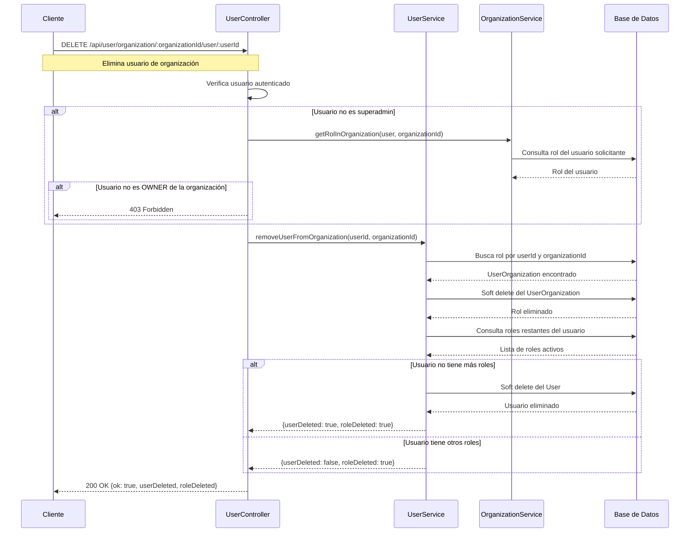

# Flujo de Eliminación de Usuario de Organización

Este documento describe el flujo para eliminar usuarios de organizaciones y la gestión de roles asociados.

## Flujo de Eliminación de Usuario de Organización



## Reglas de Negocio

1. **Permisos de eliminación**: 
   - Solo superadmins pueden eliminar cualquier rol
   - Solo el OWNER de una organización puede eliminar roles de su organización

2. **Eliminación en cascada**: 
   - Al eliminar un rol (UserOrganization), si el usuario queda sin roles activos, se elimina automáticamente

3. **Soft delete**: 
   - Tanto roles como usuarios se eliminan usando soft delete (deleted_at)

4. **Validaciones**:
   - El usuario debe tener un rol en la organización especificada
   - El usuario solicitante debe tener permisos
   - No se puede eliminar el último OWNER de una organización

## Responsabilidades

- **UserController**: Valida permisos y maneja la solicitud HTTP
- **UserService**: Ejecuta la lógica de eliminación y verifica roles restantes
- **OrganizationService**: Verifica roles del usuario en organizaciones

## Endpoints

### Endpoints Existentes
- `DELETE /api/user/global/:userId`: Elimina un usuario global (solo superadmin)
- `DELETE /api/user/role/:roleId`: Elimina un rol sin validaciones adicionales
- `POST /api/user/change-password/:userId`: Cambiar contraseña (solo superadmin) - **MODIFICADO**

### Nuevos Endpoints
- `DELETE /api/user/organization/:organizationId/user/:userId`: Elimina un usuario de una organización con validaciones de permisos y eliminación en cascada

## Diferencias entre Endpoints

| Endpoint | Permisos | Validaciones | Funcionalidad |
|----------|----------|-------------|---------------|
| `DELETE /user/global/:userId` | Solo superadmin | Básicas | Eliminación global |
| `DELETE /user/role/:roleId` | Solo superadmin | Ninguna | Eliminación simple |
| `DELETE /user/organization/:organizationId/user/:userId` | Superadmin u OWNER | Completas | Eliminación inteligente |
| `POST /user/change-password/:userId` | Superadmin u OWNER (organizaciones compartidas) | Completas | Cambio contraseña inteligente |

### Ventajas de los Nuevos Endpoints

#### Eliminación de Usuario
1. **Permisos granulares**: Permite que owners de organización eliminen usuarios de su organización
2. **Validaciones de negocio**: No permite eliminar el último OWNER
3. **Eliminación inteligente**: Si el usuario queda sin roles, lo elimina automáticamente
4. **Seguridad**: Verifica que el usuario tenga permisos sobre la organización específica

#### Cambio de Contraseña (Endpoint Modificado)
1. **Permisos descentralizados**: Owners pueden gestionar contraseñas de usuarios en organizaciones compartidas
2. **Validación inteligente**: Verifica que ambos usuarios compartan al menos una organización donde el solicitante sea OWNER
3. **Seguridad granular**: Sin necesidad de especificar organización en URL, valida automáticamente
4. **Flexibilidad**: Mantiene acceso total para superadmins y URL original

## Estructura de Datos

### Request - Eliminación de Usuario
- **userId**: ID del usuario a eliminar de la organización
- **organizationId**: ID de la organización

### Response - Eliminación de Usuario
```json
{
  "ok": true,
  "userDeleted": boolean,
  "roleDeleted": boolean,
  "message": string
}
```

### Request - Cambio de Contraseña
- **userId**: ID del usuario al que cambiar la contraseña
- **Body**: `{ "newPassword": string }`

### Response - Cambio de Contraseña
```json
{
  "ok": true,
  "message": "Password actualizado exitosamente"
}
```

## Consideraciones Técnicas

- Usar soft delete para mantener historial
- Validar que no se elimine el último OWNER de una organización
- Implementar logs de auditoría para eliminaciones y cambios de contraseña
- Verificar dependencias antes de eliminar usuarios completamente
- Validar organizaciones compartidas entre solicitante y objetivo antes de cambios
- Hashear contraseñas con bcrypt para seguridad