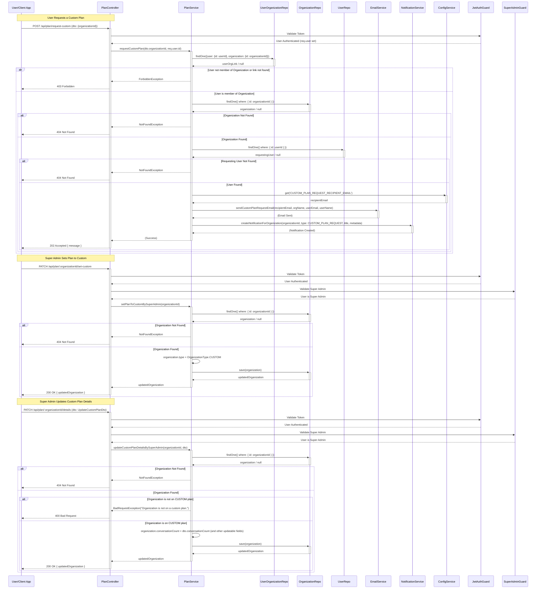

# Flujo de Gestión de Planes Personalizados

## Descripción
Este documento describe los flujos de gestión de planes personalizados en la plataforma Sofia Chat. Incluye los procesos para solicitar un plan personalizado por parte de un usuario, la aprobación y configuración de planes personalizados por parte de superadministradores, y la actualización de detalles de planes personalizados.

## Responsabilidades

### Componentes Involucrados
- **PlanController**: Maneja las solicitudes HTTP relacionadas con planes.
- **PlanService**: Contiene la lógica de negocio para la gestión de planes.
- **UserOrganizationRepository**: Verifica la pertenencia de usuarios a organizaciones.
- **OrganizationRepository**: Gestiona la información de organizaciones y sus planes.
- **NotificationService**: Envía notificaciones a usuarios relevantes.
- **EmailService**: Envía correos electrónicos de notificación.

### Ubicación en el Proyecto
- `/src/modules/plan/plan.controller.ts`
- `/src/modules/plan/plan.service.ts`
- `/src/modules/plan/dto/request-custom-plan.dto.ts`

## Diagrama de Flujo

