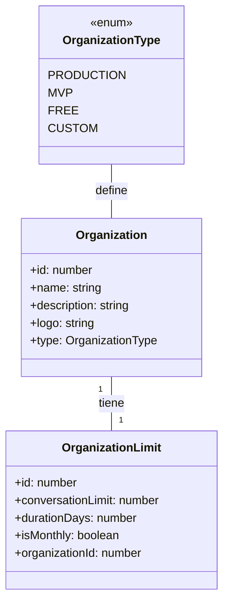
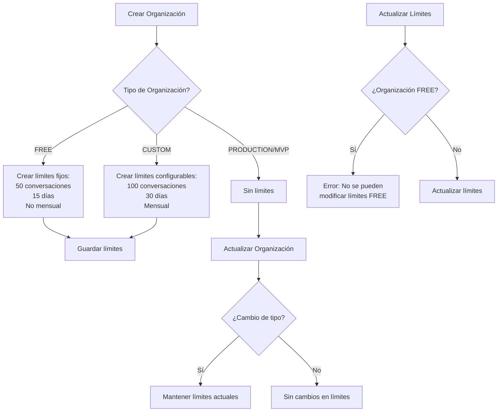
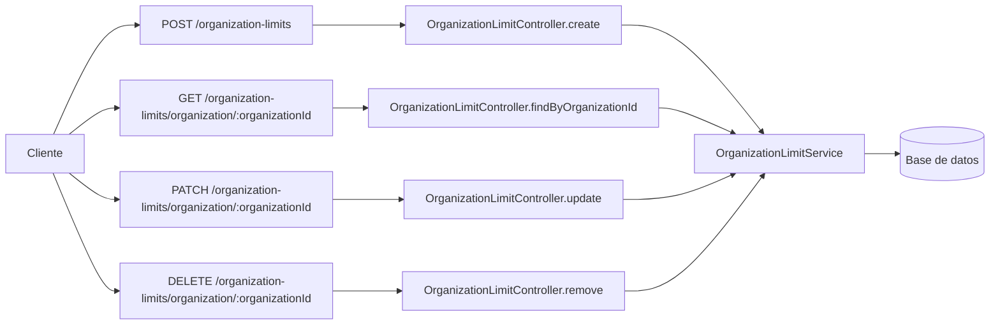

# Flujo de Límites de Organización

Este documento describe el flujo de trabajo para los límites de organización en el sistema Converxa Chat.

## Tipos de Organización

El sistema soporta cuatro tipos de organizaciones, cada una con diferentes límites:

## Flujo de Creación de Límites

El siguiente diagrama muestra el flujo para la creación y gestión de límites de organización:

## Endpoints de API

El sistema proporciona los siguientes endpoints para gestionar los límites de organización:

## Reglas de Negocio

1. Las organizaciones FREE tienen límites fijos que no pueden ser modificados:
   - 50 conversaciones
   - 15 días de duración
   - No mensual (el límite no se restablece mensualmente)

2. Las organizaciones CUSTOM tienen límites configurables:
   - Valores predeterminados: 100 conversaciones, 30 días, mensual
   - Estos valores pueden ser modificados

3. Las organizaciones PRODUCTION y MVP no tienen límites de conversaciones.
   - No se crean registros de límites para estas organizaciones
   - No es posible crear o modificar límites para estas organizaciones

4. Solo los usuarios con roles ADMIN y OWNER pueden crear y modificar límites.

5. Los usuarios con rol SUPERVISOR pueden ver los límites pero no modificarlos.
