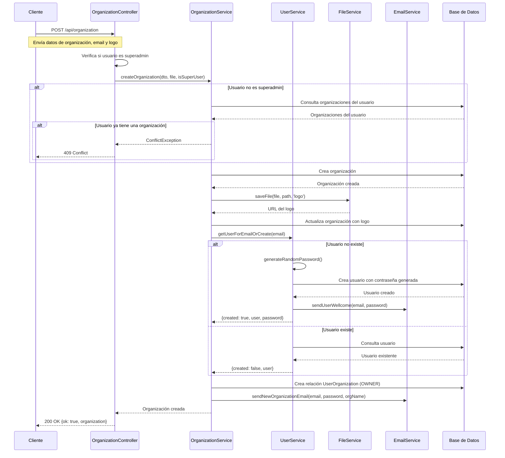

# Flujo de Creación de Organizaciones

Este documento describe el flujo de creación de organizaciones en el backend de Converxa Chat.

## Flujo de Creación de Organización

## Reglas importantes

1. **Limitación para usuarios normales**: Un usuario normal (no superadmin) solo puede crear una organización. Si intenta crear más, recibirá un error.

2. **Superadmins**: Los superadmins pueden crear múltiples organizaciones sin restricciones.

3. **Creación de usuarios**: Si el email proporcionado no corresponde a un usuario existente, se creará automáticamente un nuevo usuario con:
   - Email proporcionado
   - Contraseña generada aleatoriamente
   - Se enviará un email de bienvenida con la contraseña

4. **Asignación de roles**: El usuario proporcionado (existente o nuevo) será asignado como OWNER de la organización.

5. **Logo**: Cada organización debe tener un logo, que se guarda en el sistema de archivos.

## Responsabilidades

- **OrganizationController**: Maneja las solicitudes HTTP y verifica si el usuario es superadmin.
- **OrganizationService**: Gestiona la creación de organizaciones y la asignación de usuarios.
- **UserService**: Busca o crea usuarios según sea necesario.
- **FileService**: Maneja el almacenamiento de archivos (logo).
- **EmailService**: Envía notificaciones por email.

## Endpoints relacionados

- `POST /api/organization`: Crea una nueva organización
- `GET /api/organization/my-organizations`: Obtiene las organizaciones del usuario actual
- `GET /api/organization`: Obtiene todas las organizaciones (solo superadmin)
