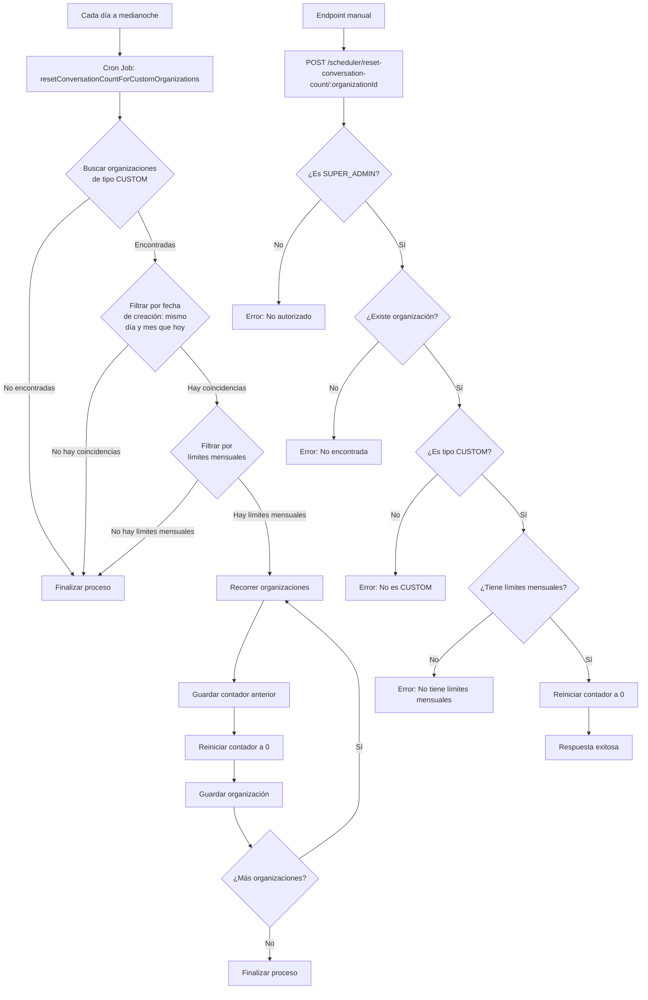
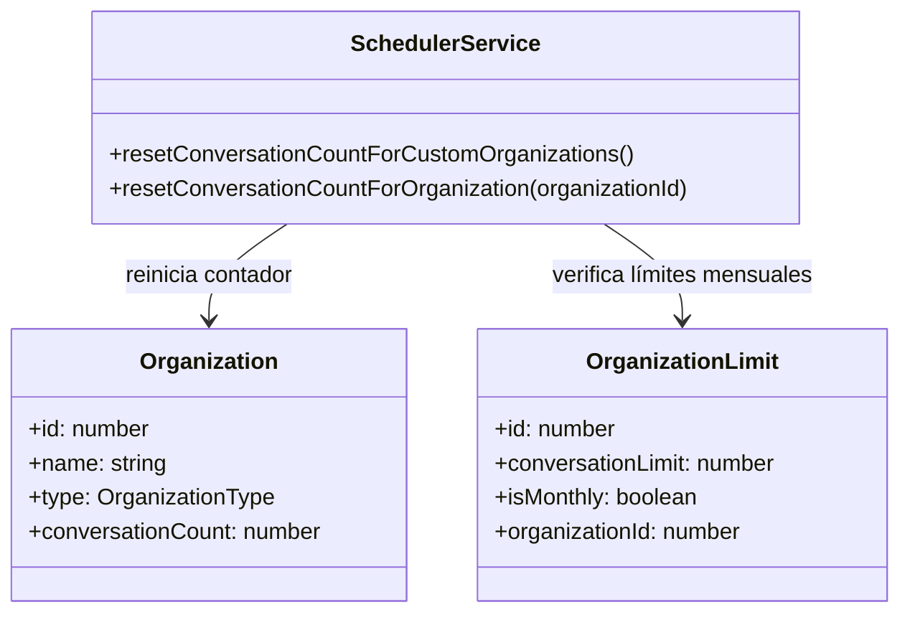

# Flujo de Reinicio de Conversaciones

Este documento describe el flujo de trabajo para el reinicio automático del contador de conversaciones en organizaciones de tipo CUSTOM que fueron creadas en el mismo día y mes que la fecha actual (aniversario).

## Diagrama de Flujo

## Componentes del Sistema

### SchedulerService

El servicio `SchedulerService` es responsable de ejecutar las tareas programadas, incluyendo el reinicio mensual del contador de conversaciones para organizaciones de tipo CUSTOM.

## Reglas de Negocio

1. El contador de conversaciones se reinicia automáticamente cada día a medianoche, pero solo para las organizaciones de tipo CUSTOM que fueron creadas en el mismo día y mes que la fecha actual (aniversario) y que tengan límites mensuales configurados.

2. El sistema verifica la fecha de creación de cada organización CUSTOM y solo reinicia aquellas cuyo día y mes de creación coinciden con el día y mes actual.

3. Solo las organizaciones de tipo CUSTOM con el campo `isMonthly = true` en su configuración de límites son elegibles para el reinicio automático.

4. El reinicio establece el contador `conversationCount` a 0, permitiendo que la organización comience un nuevo ciclo de uso.

5. Los superadministradores pueden reiniciar manualmente el contador de conversaciones para una organización específica a través del endpoint `POST /scheduler/reset-conversation-count/:organizationId`.

6. El reinicio manual solo está disponible para organizaciones de tipo CUSTOM con límites mensuales configurados.

## Endpoints de API

| Método | Ruta | Descripción | Roles permitidos |
|--------|------|-------------|------------------|
| POST | /scheduler/reset-conversation-count/:organizationId | Reinicia manualmente el contador de conversaciones para una organización específica | SUPER_ADMIN |

## Cron Jobs

| Nombre | Expresión Cron | Descripción |
|--------|----------------|-------------|
| resetConversationCountForCustomOrganizations | EVERY_DAY_AT_MIDNIGHT | Reinicia automáticamente el contador de conversaciones para las organizaciones de tipo CUSTOM que fueron creadas en el mismo día y mes que la fecha actual y que tengan límites mensuales |

## Notas Importantes

- El reinicio del contador solo afecta al campo `conversationCount` en la entidad `Organization`. No afecta a las conversaciones existentes ni a su historial.
- Si una organización cambia su tipo de CUSTOM a otro tipo, o si se desactiva el flag `isMonthly` en sus límites, dejará de ser elegible para el reinicio automático.
- El sistema registra logs detallados de cada operación de reinicio para facilitar la auditoría y solución de problemas.
