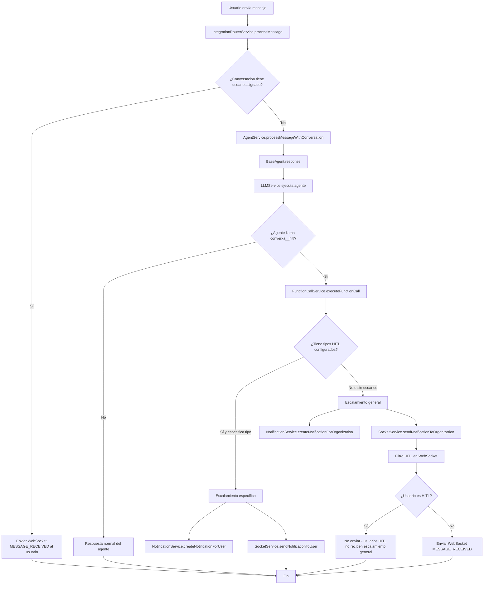

# Flujo de Procesamiento de Mensajes y Escalamiento

## Qué hace
Procesa mensajes de usuarios, ejecuta agentes IA y maneja escalamientos a humanos cuando la IA no puede resolver la consulta.

## Diagrama de flujo



## Componentes y responsabilidades

### IntegrationRouterService.processMessage()
- **Ubicación**: `src/modules/integration-router/integration.router.service.ts`
- **Responsabilidad**: Punto de entrada para mensajes, decide si procesar con IA o notificar usuario asignado
- **Entrada**: mensaje, conversationId, imágenes
- **Salida**: Respuesta del agente o null

### AgentService.processMessageWithConversation()
- **Ubicación**: `src/modules/agent/agentServer.ts`
- **Responsabilidad**: Configurar agente y procesar mensaje
- **Coordina**: Configuración de agente, ejecución de LLM

### BaseAgent.response()
- **Ubicación**: `src/services/llm-agent/base-agent.ts`
- **Responsabilidad**: Ejecutar agente LLM y manejar funciones
- **Ejecuta**: Hilo de conversación, funciones del agente

### FunctionCallService.executeFunctionCall()
- **Ubicación**: `src/modules/agent/function-call.service.ts`
- **Responsabilidad**: Ejecutar función converxa__hitl y manejar escalamientos
- **Tipos**: Escalamiento específico vs general

### NotificationService
- **Ubicación**: `src/modules/notification/notification.service.ts`
- **Responsabilidades**:
  - `createNotificationForUser()`: Notificaciones específicas (tipo USER)
  - `createNotificationForOrganization()`: Notificaciones generales (tipo SYSTEM)

### SocketService
- **Ubicación**: `src/modules/socket/socket.service.ts`
- **Responsabilidades**:
  - `sendNotificationToUser()`: WebSocket a usuario específico
  - `sendNotificationToOrganization()`: WebSocket a organización con filtro HITL

## Estructura de datos

### Mensaje de entrada
```typescript
{
  message: string;
  conversationId: number;
  images?: string[];
}
```

### Notificación BD tipo SYSTEM (escalamiento general)
```typescript
{
  organizationId: number;
  type: 'SYSTEM';
  title: string;
  userId: null; // Sin usuario específico
  metadata: { conversationId: number };
}
```

### Notificación BD tipo USER (escalamiento específico)
```typescript
{
  organizationId: number;
  type: 'USER';
  title: string;
  userId: number; // Usuario específico
  metadata: { conversationId: number, hitlType: string };
}
```

### Evento WebSocket MESSAGE_RECEIVED
```typescript
{
  type: 'messageReceived';
  message: string;
  data: {
    conversationId: number;
    hitlType?: string;
  };
}
```

## Reglas de negocio

### Procesamiento de mensajes
- Si conversación tiene usuario asignado → notificar usuario, no procesar con IA
- Si no tiene usuario → procesar con agente IA

### Escalamiento específico (con tipos HITL)
- Crear notificación BD tipo USER para cada usuario del tipo HITL
- Enviar WebSocket con `sendNotificationToUser()` (sin filtro)
- Usuarios HITL SÍ reciben estas notificaciones (son específicas para ellos)

### Escalamiento general (sin tipos HITL o fallback)
- Crear notificación BD tipo SYSTEM sin userId específico
- Enviar WebSocket con `sendNotificationToOrganization()` (con filtro HITL)
- Usuarios HITL NO reciben estas notificaciones (filtro en WebSocket)

### Filtro HITL en WebSocket
- Aplicado solo en `sendNotificationToOrganization()`
- Usuarios con rol HITL no reciben eventos MESSAGE_RECEIVED de escalamiento general
- Consistente con filtro de BD: HITL solo recibe notificaciones con `userId` específico

### Consulta de roles
- Una sola consulta `UserOrganization.find()` con `In(userIds)`
- Map<userId, role> para búsqueda O(1)
- Deduplicación de userIds únicos
