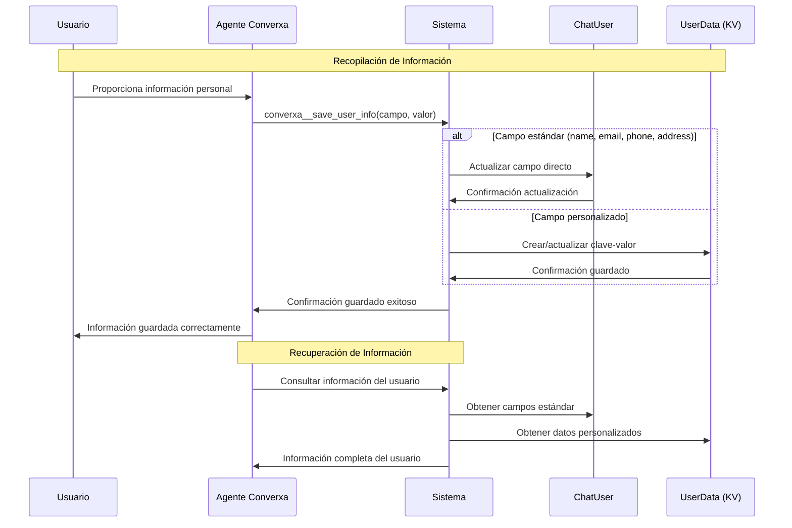

# Caso de Uso: Guardar Información del Usuario

## Descripción
Sistema que permite al agente recopilar y almacenar información personal del usuario durante las conversaciones. El agente puede guardar datos tanto en campos estándar (nombre, email, teléfono, dirección) como en un sistema de clave-valor para información personalizada. La información se guarda bajo la discreción del agente cuando el usuario la proporciona durante la conversación.

## Flujo Principal

## Componentes Involucrados

### Entidades
- **ChatUser**: Tabla existente con campos estándar
  - `name`: Nombre del usuario
  - `email`: Correo electrónico
  - `phone`: Número de teléfono
  - `address`: Dirección
  - `avatar`: URL del avatar (opcional)

- **ChatUserData**: Nueva tabla para datos clave-valor
  - `id`: Identificador único
  - `chat_user_id`: Referencia al ChatUser
  - `key`: Clave del dato (ej: "empresa", "edad", "preferencias")
  - `value`: Valor del dato
  - `created_at`: Fecha de creación
  - `updated_at`: Fecha de actualización

### Funciones del Agente
- **converxa__save_user_info**: Función para guardar información del usuario
  - Parámetros:
    - `campo`: string - Nombre del campo (ej: "name", "email", "empresa")
    - `valor`: string - Valor a guardar
  - Comportamiento:
    - Si el campo es estándar (name, email, phone, address): actualiza ChatUser
    - Si el campo es personalizado: crea/actualiza en ChatUserData
    - Valida formato de email si el campo es "email"
    - Normaliza el teléfono si el campo es "phone"

### Servicios
- **ChatUserService**: Servicio existente extendido
  - `updateUserInfo()`: Actualizar campos estándar
  - `saveCustomUserData()`: Guardar datos personalizados
  - `getUserCompleteInfo()`: Obtener información completa del usuario

- **ChatUserDataService**: Nuevo servicio para datos clave-valor
  - `createOrUpdate()`: Crear o actualizar dato personalizado
  - `findByUserAndKey()`: Buscar dato específico por clave
  - `findAllByUser()`: Obtener todos los datos del usuario

### Endpoints API
- **GET /api/chat-users/:id/info**: Obtener información completa del usuario
- **PUT /api/chat-users/:id/info**: Actualizar información del usuario (admin)

## Reglas de Negocio

1. **Discreción del Agente**: La información solo se guarda cuando el usuario la proporciona voluntariamente durante la conversación
2. **Campos Estándar**: name, email, phone, address se guardan directamente en ChatUser
3. **Campos Personalizados**: Cualquier otro campo se guarda en ChatUserData como clave-valor
4. **Validaciones**:
   - Email debe tener formato válido
   - Teléfono se normaliza automáticamente
   - Claves no pueden estar vacías
   - Valores se almacenan como string
5. **Actualización**: Si ya existe información, se actualiza con el nuevo valor
6. **Privacidad**: La información se asocia únicamente al ChatUser específico
7. **Opcional**: Todos los campos son opcionales, el usuario no está obligado a proporcionar información

### Validaciones Implementadas
- Formato de email válido para campo "email"
- Normalización de número telefónico para campo "phone"
- Sanitización de datos de entrada
- Verificación de existencia del ChatUser
- Límite de longitud para claves y valores

## Consideraciones Técnicas

### Archivos Nuevos
- **ChatUserData.entity.ts**: Nueva entidad para datos clave-valor
- **chat-user-data.service.ts**: Servicio para gestión de datos personalizados
- **chat-user-data.module.ts**: Módulo para datos personalizados

### Archivos Modificados
- **ChatUser.entity.ts**: Agregar relación OneToMany con ChatUserData
- **chat-user.service.ts**: Extender con métodos para información completa
- **function-call.service.ts**: Agregar función converxa__save_user_info
- **base-agent.ts**: Incluir definición de función para agentes
- **converxa-llm.service.ts**: Renderizado para OpenAI
- **claude-sonet.service.ts**: Renderizado para Anthropic

### Base de Datos
- **Nueva tabla**: chat_user_data
- **Migración**: Crear tabla con índices apropiados
- **Relaciones**: ChatUser OneToMany ChatUserData
- **Índices**: Índice compuesto en (chat_user_id, key) para búsquedas rápidas

### Dependencias
- **TypeORM**: Para nueva entidad y relaciones
- **class-validator**: Para validaciones de entrada
- **AgentModule**: Integración con sistema de funciones del agente
