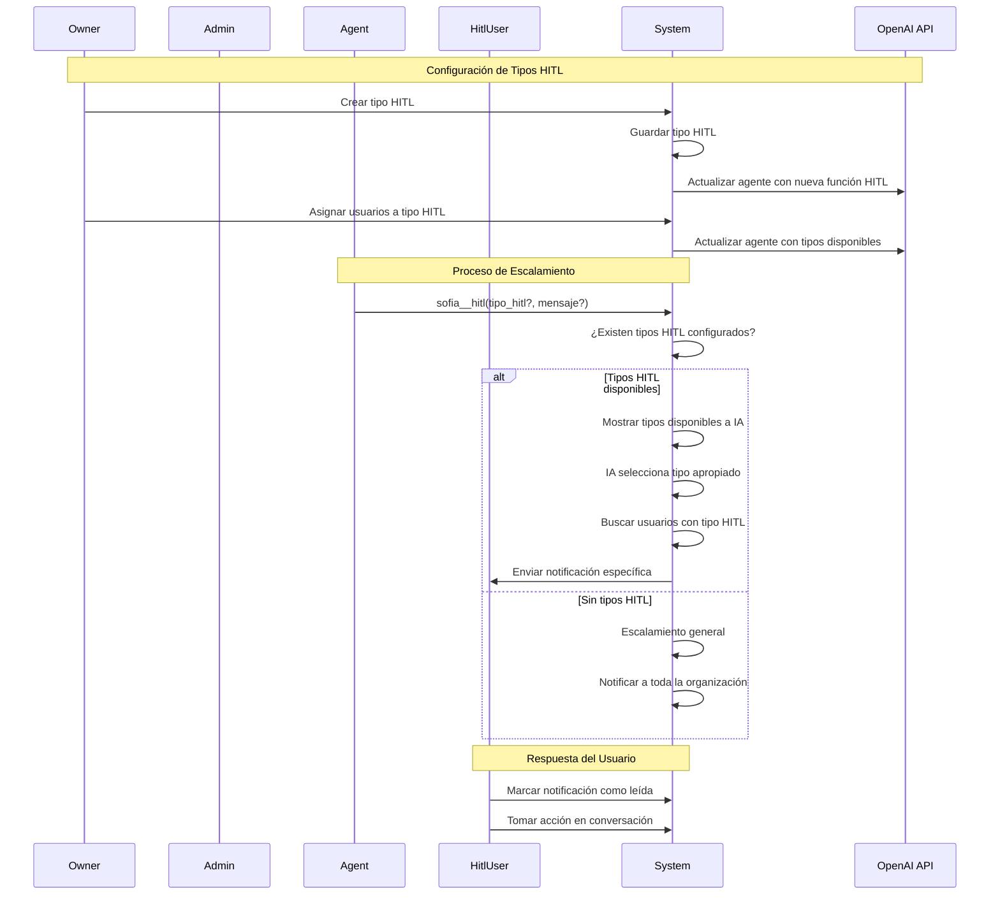

# Caso de Uso: Notificaciones HITL (Human In The Loop)

## Descripción
Sistema de notificaciones especializadas por tipo de HITL que permite al owner definir tipos específicos de intervención humana y asignar usuarios especializados para cada tipo. El agente puede escalamientos dirigidos a usuarios especializados cuando existen tipos HITL configurados, o usar escalamiento general cuando no hay tipos específicos definidos.

## Flujo Principal



## Componentes Involucrados

### Entidades
- **HitlType**: Nueva tabla para tipos de HITL
  - `id`: Identificador único
  - `name`: Nombre del tipo (ej: "soporte_tecnico", "ventas_especializadas")
  - `description`: Descripción del tipo
  - `organization_id`: Organización propietaria
  - `created_by`: Usuario owner que creó el tipo

- **UserHitlType**: Nueva tabla relacional usuarios-tipos HITL
  - `id`: Identificador único
  - `user_id`: Usuario asignado
  - `hitl_type_id`: Tipo de HITL asignado
  - `organization_id`: Organización

### Funciones del Agente
- **sofia__hitl**: Función consolidada de escalamiento
  - Parámetros opcionales: `tipo_hitl`, `mensaje`
  - Comportamiento inteligente:
    - Si la organización tiene tipos HITL: la IA puede elegir entre los tipos disponibles
    - Si no hay tipos HITL: escalamiento general legacy
    - Si se especifica tipo_hitl pero no hay usuarios: fallback a escalamiento general
  - Valida automáticamente disponibilidad de tipos y usuarios

### Endpoints API (Probados ✅)
- **POST /api/organizations/{orgId}/hitl-types**: Crear tipo HITL (solo OWNER)
- **GET /api/organizations/{orgId}/hitl-types**: Listar tipos de organización
- **GET /api/organizations/{orgId}/hitl-types/{id}**: Obtener tipo específico
- **PATCH /api/organizations/{orgId}/hitl-types/{id}**: Actualizar tipo HITL (solo OWNER)
- **DELETE /api/organizations/{orgId}/hitl-types/{id}**: Eliminar tipo HITL (solo OWNER)
- **POST /api/organizations/{orgId}/hitl-types/{id}/users**: Asignar usuarios a tipo (solo OWNER)
- **DELETE /api/organizations/{orgId}/hitl-types/{id}/users/{userId}**: Remover usuario de tipo (solo OWNER)

### Endpoints Relacionados
- **GET /api/user**: Obtener perfil completo con todas las userOrganizations
- **GET /api/user/all/{orgId}**: Obtener usuarios de organización (filtrar role === 'hitl' en frontend)
- **POST /api/auth/log-in**: Autenticación para obtener JWT token

### Modificaciones al Sistema de Notificaciones
- **NotificationService.createNotificationForUser()**: Notificaciones tipo USER para HITL
- **SocketService.sendNotificationToOrganization()**: Filtrado HITL con consulta única de roles por organización
- **NotificationController**: Endpoints para gestión HITL

## Estructura de Datos

### HitlType
```typescript
{
  id: number;
  name: string;
  description: string;
  organization_id: number;
  created_by: number;
  created_at: Date;
  updated_at: Date;
  deleted_at: Date | null;
  creator: User;
  userHitlTypes: UserHitlType[];
}
```

### UserHitlType
```typescript
{
  id: number;
  user_id: number;
  hitl_type_id: number;
  organization_id: number;
  created_at: Date;
  updated_at: Date;
  deleted_at: Date | null;
  user: User;
}
```

### Función sofia__hitl
```typescript
{
  tipo_hitl?: string; // Opcional - mostrado dinámicamente según tipos disponibles
  mensaje?: string;   // Opcional - requerido solo cuando se usa tipo_hitl
}
```

## Reglas de Negocio

1. **Permisos**: Solo usuarios con rol OWNER pueden crear y gestionar tipos HITL
2. **Validación**: Un usuario solo puede ser asignado a tipos HITL de su organización
3. **Escalamiento Inteligente**: 
   - Con tipos HITL: notificación dirigida a usuarios especializados
   - Sin tipos HITL: escalamiento general a toda la organización
   - Fallback automático si no hay usuarios del tipo específico
4. **Rol Requerido**: El usuario debe tener rol HITL en la organización para ser asignado a tipos
5. **Unicidad**: Un usuario puede estar asignado a múltiples tipos HITL
6. **Verificación por Organización**: Todos los permisos se verifican específicamente por organización
7. **Acceso Granular**: El sistema valida acceso basado en el organizationId de la URL del endpoint
8. **Compatibilidad**: Mantiene compatibilidad con escalamiento legacy sin tipos HITL

### Validaciones Implementadas
- Verificación de rol OWNER para gestión de tipos HITL
- Validación de pertenencia a organización específica
- Verificación de rol HITL antes de asignación
- Unicidad de nombres de tipos HITL por organización
- Eliminación en cascada de asignaciones al eliminar tipos

### Consideraciones Técnicas

### Optimización de Notificaciones WebSocket
- **Consulta Única**: UserOrganizationRepository.find() con `In(userIds)` en lugar de N consultas
- **Deduplicación**: Solo userIds únicos con `[...new Set()]`
- **Búsqueda Eficiente**: Map<userId, role> para acceso O(1)
- **Early Return**: Salida temprana si no hay clientes conectados
- **Type Safety**: Filtros de tipo para valores null/undefined

### Arquitectura Multi-Agente
- **Relación Organizacional**: Una organización puede tener múltiples departamentos, cada uno con su propio agente
- **Actualización Completa**: Cuando se modifican tipos HITL, se actualizan TODOS los agentes de la organización
- **Event-Driven Updates**: Sistema de eventos desacoplado para evitar dependencias circulares
- **Logging Detallado**: Logs específicos para troubleshooting de actualizaciones multi-agente

### Optimización de Notificaciones WebSocket
- **Consulta Única**: Eliminación del patrón N+1 queries en `sendNotificationToOrganization()`
- **Rendimiento**: De N consultas DB (una por cliente conectado) a 1 consulta con `In(userIds)`
- **Map Lookup**: Búsqueda O(1) de roles usando `Map<userId, role>` después de consulta única
- **Deduplicación**: Solo consulta userIds únicos para minimizar datos transferidos
- **Early Return**: Salida temprana si no hay clientes conectados
- **Type Safety**: Filtros de tipo para manejar valores null/undefined correctamente

### Arquitectura Refactorizada
- **BaseAgent**: Contiene lógica genérica para obtener tipos HITL usando `getHitlTypes()`
- **SofiaLLMService**: Implementa renderizado específico para OpenAI con `renderHITL()`
- **ClaudeSonetService**: Implementa renderizado específico para Anthropic con `renderHITLForClaude()`
- **FunctionCallService**: Maneja ejecución de escalamientos HITL con logs detallados
- **AgentManagerService**: Event listeners para actualización automática de múltiples agentes
- **HitlTypesService**: Emisión de eventos en lugar de llamadas directas para evitar ciclos

### Archivos Modificados
- **HitlType.entity.ts**: Nueva entidad para tipos HITL
- **UserHitlType.entity.ts**: Nueva entidad relacional usuarios-tipos
- **UserOrganization.entity.ts**: Agregado campo organizationId explícito
- **core.module.ts**: Nuevo módulo centralizado con HitlTypesService y EventEmitter
- **hitl-types.module.ts**: Simplificado, solo controller, importa CoreModule
- **hitl-types.service.ts**: Sistema de eventos en lugar de llamadas directas a AgentManager
- **agent-manager.service.ts**: Event listeners y actualización de TODOS los agentes por organización
- **function-call.service.ts**: Función sofia__hitl consolidada con lógica inteligente y logs detallados
- **base-agent.ts**: Método genérico `getHitlTypes()` para obtener tipos HITL por organización
- **sofia-llm.service.ts**: Renderizado específico OpenAI con definición dinámica según tipos disponibles
- **claude-sonet.service.ts**: Renderizado específico Anthropic con soporte completo HITL
- **agentServer.ts**: Integración de HitlTypesService como dependencia en ambos agentes
- **user.service.ts**: Método findById corregido para retornar todas las organizaciones
- **jwt-auth-roles.guard.ts**: Verificación de permisos por organización específica
- **get-organization.decorator.ts**: ParseInt corregido para extraer organizationId
- **hitl-events.ts**: Nuevas interfaces para eventos HITL
- **app.module.ts**: Importación de CoreModule
- **socket.service.ts**: Optimización de consultas en `sendNotificationToOrganization()` para eliminar N+1 queries

### Base de Datos
- **Tablas nuevas**: hitl_types, user_hitl_types
- **Migraciones**: Ejecutadas automáticamente
- **Relaciones**: UserOrganizations contiene organizationId directo

### Dependencias
- **CoreModule**: HitlTypesService centralizado sin dependencias circulares
- **EventEmitterModule**: Sistema de eventos para actualización de agentes desacoplada
- **TypeORM**: Configurado con relaciones y validaciones apropiadas
- **OpenAI Integration**: Función sofia__hitl con parámetros dinámicos según tipos disponibles
- **Anthropic Integration**: Función sofia__hitl con soporte completo para Claude
- **BaseAgent**: Dependencia HitlTypesService inyectada para acceso genérico a tipos HITL
- **AgentManagerService**: Listeners de eventos para actualización automática de agentes

## Estado de Implementación

### ✅ Completado y Probado
- Todas las entidades y relaciones
- Todos los endpoints CRUD funcionando
- Validaciones de permisos (solo OWNER puede gestionar)
- Asignación y remoción de usuarios HITL
- Función sofia__hitl consolidada con lógica inteligente
- Sistema de notificaciones integrado con escalamiento específico y general
- Verificación de permisos por organización específica
- Integración completa con servicios de agente (AgentService y AgentManagerService)
- **Refactorización de Responsabilidades**: BaseAgent maneja lógica genérica, servicios específicos manejan formato de API
- **Soporte Multi-Proveedor**: SofiaLLM (OpenAI) y ClaudeSonet (Anthropic) ambos soportan HITL
- **Logs de Debugging**: Sistema completo de logs con prefijo [HITL DEBUG] para troubleshooting
- **Actualización Multi-Agente**: Sistema actualiza TODOS los agentes de TODOS los departamentos de una organización
- **Sistema de Eventos**: Arquitectura desacoplada con EventEmitter para actualización automática de agentes
- **Eliminación de Dependencias Circulares**: CoreModule centraliza servicios sin crear ciclos

### 🔧 Correcciones Críticas Realizadas
- **UserService.findById()**: Removido select específico para retornar todas las userOrganizations del usuario
- **GetOrganization decorator**: Corregido parseInt(organizationId, 10) en lugar de parseInt(organizationId, -1)
- **JwtAuthRolesGuard**: Implementada verificación de roles por organización específica extraída de URL
- **UserOrganization.entity**: Agregado campo organizationId explícito para compatibilidad
- **Consolidación de Funciones**: Eliminada sofia__hitl_notify, toda la lógica consolidada en sofia__hitl
- **Definición Dinámica**: sofia__hitl ahora muestra parámetros dinámicamente según tipos HITL disponibles
- **Módulos**: HitlTypesModule correctamente importado en AgentModule y AgentManagerModule
- **Refactorización de Arquitectura**: Movida lógica genérica a BaseAgent, manteniendo compatibilidad específica por proveedor
- **Inyección de Dependencias**: HitlTypesService correctamente inyectado en BaseAgent y propagado a servicios específicos
- **Compatibilidad Multi-Proveedor**: ClaudeSonetService actualizado para soportar HITL con mismo comportamiento que SofiaLLM
- **Actualización Multi-Departamento**: Corregido para actualizar TODOS los agentes de TODOS los departamentos en una organización
- **Event-Driven Architecture**: Implementado sistema de eventos para desacoplar actualización de agentes
- **CoreModule Integration**: HitlTypesService movido a CoreModule eliminando dependencias circulares

### 🔍 Problemas Identificados y Resueltos
1. **Bucle infinito en frontend**: UserService retornaba solo 1 organización por problemas en select
2. **Permisos incorrectos**: Guard verificaba roles globalmente en lugar de por organización
3. **ParseInt malformado**: Decorador causaba NaN por radix inválido
4. **Relaciones incompletas**: Select limitaba la carga completa de userOrganizations
5. **Duplicación de Responsabilidades**: Consolidada lógica de escalamiento en una sola función
6. **Definición Estática**: Función ahora es dinámica según configuración de la organización
- **Dependencias Faltantes**: HitlTypesService integrado en todos los servicios de agente necesarios
8. **Actualización Parcial de Agentes**: Solo se actualizaba el primer agente encontrado por organización, no todos los departamentos
9. **Sistema de Eventos Implementado**: EventEmitter2 para comunicación desacoplada entre HitlTypesService y AgentManagerService
10. **Logs Mejorados**: Sistema de logging detallado para troubleshooting de actualizaciones multi-agente