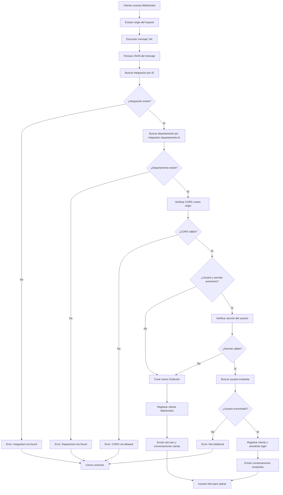

# WebChat WebSocket - Flujo de Inicialización

## Qué hace
Maneja la conexión WebSocket para el chat web, desde la inicialización hasta el envío de conversaciones existentes.

## Diagrama de flujo

## Componentes y responsabilidades

### WebChatSocketGateway
- **Ubicación**: `src/modules/socket/socket.gateway.ts`
- **Responsabilidad**: Manejar conexiones WebSocket y flujo de inicialización
- **Métodos clave**:
  - `onModuleInit()`: Configurar servidor WebSocket
  - `bindServer()`: Vincular servidor HTTP para upgrade

### IntegrationService
- **Ubicación**: `src/modules/integration/integration.service.ts`
- **Responsabilidad**: Obtener configuración de integración y departamento
- **Métodos utilizados**:
  - `getIntegrationWebChatById()`
  - `getDepartamentoById()`

### ChatUserService
- **Ubicación**: `src/modules/chat-user/chat-user.service.ts`
- **Responsabilidad**: Gestionar usuarios del chat web
- **Métodos utilizados**:
  - `createChatUserWeb()`
  - `findByIdWithSecret()`
  - `findById()`
  - `updateLastLogin()`

### SocketService
- **Ubicación**: `src/modules/socket/socket.service.ts`
- **Responsabilidad**: Registrar y gestionar clientes WebSocket
- **Métodos utilizados**:
  - `registerWebChatClient()`
  - `removeWebChatClient()`
