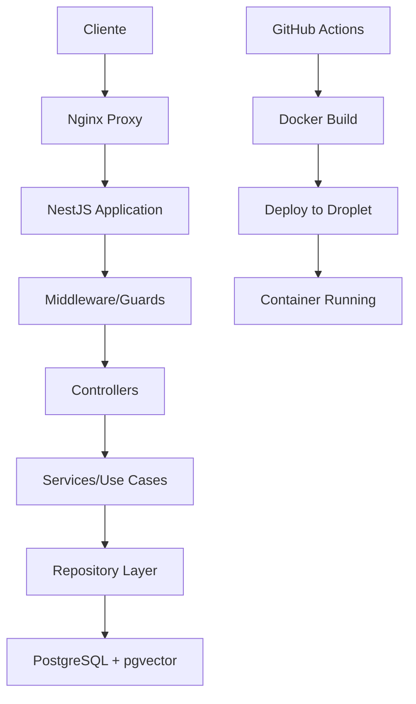

# Arquitectura Sofia Chat Backend v2

## Estructura General del Proyecto

### Organización de Carpetas

```
sofia-chat-backend-v2/
├── src/                    # Código fuente principal
│   ├── config/            # Configuraciones (DB, JWT, etc.)
│   ├── modules/           # Módulos funcionales (auth, organizations, etc.)
│   ├── common/            # Utilidades compartidas y decoradores
│   └── main.ts            # Punto de entrada de la aplicación
├── scripts/               # Scripts de automatización y configuración
├── docu/                  # Documentación de casos de uso
├── test/                  # Pruebas unitarias e integración
├── uploads/               # Archivos subidos por usuarios
├── logs/                  # Logs de la aplicación
└── infrastructure/        # Configuración Terraform (nuevo)
```

### Stack Tecnológico

- **Framework**: NestJS (Node.js)
- **Base de Datos**: PostgreSQL con pgvector
- **Autenticación**: JWT + Refresh Tokens
- **ORM**: TypeORM
- **Containerización**: Docker + Docker Compose
- **Proxy Reverso**: Nginx
- **SSL**: Let's Encrypt (Certbot)
- **CI/CD**: GitHub Actions
- **Infraestructura**: DigitalOcean Droplets

### Patrones Arquitecturales

1. **Modular por Dominio**: Cada funcionalidad en su propio módulo
2. **Inyección de Dependencias**: Uso de decoradores NestJS
3. **Programación Funcional**: Preferencia por funciones puras
4. **Tipado Fuerte**: TypeScript con interfaces estrictas
5. **Casos de Uso**: Un hook/servicio por responsabilidad específica

### Flujo de Datos Principal



### Responsabilidades por Capa

#### Controllers
- Validación de entrada HTTP
- Manejo de respuestas y errores
- Aplicación de guards y decoradores

#### Services (Casos de Uso)
- Lógica de negocio específica
- Coordinación entre repositorios
- Validaciones de dominio

#### Repositories
- Acceso a datos
- Queries específicas de TypeORM
- Mapeo de entidades

#### Common
- Decoradores personalizados
- Utilidades compartidas
- Tipos y interfaces globales

### Configuración de Despliegue Actual

#### Entorno de Desarrollo
- **Dominio**: dev-sofia-chat.sofiacall.com
- **Puerto**: 3001
- **SSL**: Automático con Let's Encrypt
- **Base de Datos**: PostgreSQL con pgvector

#### Flujo de CI/CD
1. Push a rama `develop`
2. GitHub Actions ejecuta build
3. Deploy automático via SSH
4. Instalación de dependencias
5. Build de imagen Docker
6. Restart de containers

### Consideraciones de Blue-Green Deployment

La arquitectura actual soporta un solo contenedor en producción. Para Blue-Green se requiere:

1. **Dos Contenedores Paralelos**: backend_blue y backend_green
2. **Puertos Diferenciados**: 3001 (blue) y 3002 (green)
3. **Nginx Upstreams**: Configuración dinámica de proxy
4. **Scripts de Control**: Automatización del switching
5. **Terraform**: Infraestructura como código para replicación

### Reglas de Desarrollo

- Archivos máximo 500 líneas
- Componentes máximo 30 líneas
- Un caso de uso por archivo
- No anidación de casos de uso
- Evitar `any`, usar tipado estricto
- Usar enums en lugar de union types de strings
- No queries dentro de ciclos
- Flujo lineal con inyección de dependencias