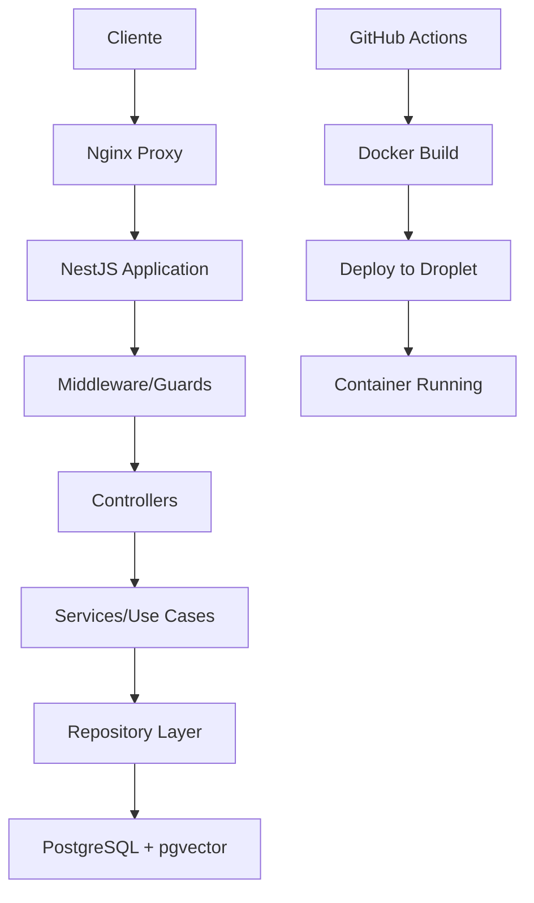

# Arquitectura Sofia Chat Backend v2

## Estructura General del Proyecto

### Organización de Carpetas

```
sofia-chat-backend-v2/
├── src/                    # Código fuente principal
│   ├── config/            # Configuraciones (DB, JWT, etc.)
│   ├── modules/           # Módulos funcionales (auth, organizations, etc.)
│   ├── common/            # Utilidades compartidas y decoradores
│   └── main.ts            # Punto de entrada de la aplicación
├── scripts/               # Scripts de automatización y configuración
├── docu/                  # Documentación de casos de uso y flujos
├── test/                  # Pruebas unitarias e integración
├── uploads/               # Archivos subidos por usuarios
├── logs/                  # Logs de la aplicación
└── infrastructure/        # Configuración Terraform (nuevo)
```

### Stack Tecnológico

- **Framework**: NestJS (Node.js)
- **Base de Datos**: PostgreSQL con pgvector
- **Autenticación**: JWT + Refresh Tokens
- **ORM**: TypeORM
- **Containerización**: Docker + Docker Compose
- **Proxy Reverso**: Nginx
- **SSL**: Let's Encrypt (Certbot)
- **CI/CD**: GitHub Actions
- **Infraestructura**: DigitalOcean Droplets

### Patrones Arquitecturales

1. **Modular por Dominio**: Cada funcionalidad en su propio módulo
2. **Inyección de Dependencias**: Uso de decoradores NestJS
3. **Programación Funcional**: Preferencia por funciones puras
4. **Tipado Fuerte**: TypeScript con interfaces estrictas
5. **Casos de Uso**: Un hook/servicio por responsabilidad específica

### Flujo de Datos Principal



### Responsabilidades por Capa

#### Controllers

#### Services (Casos de Uso)

#### Repositories

#### Common

### Reglas de Desarrollo

- Archivos máximo 500 líneas
- Componentes máximo 30 líneas
- Un caso de uso por archivo
- No anidación de casos de uso
- Evitar `any`, usar tipado estricto
- Usar enums en lugar de union types de strings
- No queries dentro de ciclos
- Flujo lineal con inyección de dependencias

#### Patrones de Implementación
- BaseAgent: Lógica genérica compartida
- Servicios específicos: Renderizado por proveedor (OpenAI, Claude)
- FunctionCallService: Ejecución centralizada de funciones
- Validaciones y logs: Trazabilidad completa de ejecución

### Sistema de Permisos

#### Roles por Organización
- **OWNER**: Acceso completo a configuración y notificaciones
- **ADMIN**: Gestión operativa y notificaciones organizacionales
- **USER**: Acceso a funcionalidades básicas y notificaciones
- **HITL**: Especialista en intervención humana, notificaciones asignadas
- **Otros**: Acceso restringido según configuración
