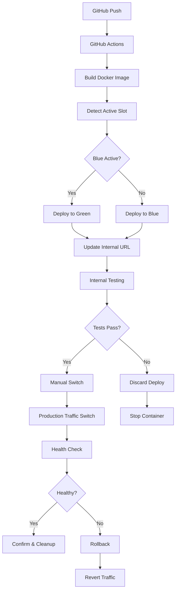
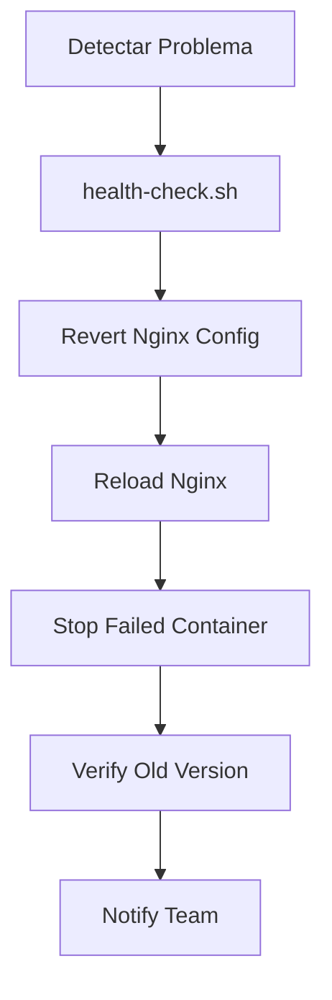

# Flujo Blue-Green Deployment

## Descripción General

Sistema de despliegue Blue-Green que permite desplegar nuevas versiones del backend sin tiempo de inactividad, con capacidad de pruebas internas y rollback inmediato.

## Componentes Involucrados

### Infraestructura
- **Nginx**: Proxy reverso con configuración de upstreams dinámicos
- **Docker Containers**: backend_blue (puerto 3001) y backend_green (puerto 3002)
- **PostgreSQL**: Base de datos compartida entre ambos entornos
- **GitHub Actions**: Automatización de build y deploy

### Dominios
- **Producción**: `dev-sofia-chat.sofiacall.com` → Apunta al entorno activo
- **Pruebas Internas**: `internal-dev-sofia-chat.sofiacall.com` → Apunta al entorno inactivo

### Scripts de Control
- **`blue-green-control.sh`**: Script maestro para gestionar el ciclo
- **`deploy-to-slot.sh`**: Deploy automático al slot inactivo
- **`switch-traffic.sh`**: Cambio de tráfico entre entornos
- **`health-check.sh`**: Verificación de salud de contenedores

## Flujo de Despliegue



## Estados del Sistema

### Estado Inicial
- **Blue**: Activo en producción (puerto 3001)
- **Green**: Inactivo
- **Nginx Prod**: → backend_blue
- **Nginx Internal**: → backend_blue

### Después del Deploy
- **Blue**: Activo en producción (puerto 3001)
- **Green**: Nuevo código en pruebas (puerto 3002)
- **Nginx Prod**: → backend_blue
- **Nginx Internal**: → backend_green

### Después del Switch
- **Blue**: Código anterior (puerto 3001)
- **Green**: Activo en producción (puerto 3002)
- **Nginx Prod**: → backend_green
- **Nginx Internal**: → backend_green

## Comandos de Control

### Detectar Estado Actual
```bash
./blue-green-control.sh status
```

### Deploy Automático
```bash
./blue-green-control.sh deploy [commit-hash]
```

### Cambiar Tráfico
```bash
./blue-green-control.sh switch
```

### Rollback
```bash
./blue-green-control.sh rollback
```

### Limpiar Entorno Inactivo
```bash
./blue-green-control.sh cleanup
```

## Configuración Nginx

### Upstreams Dinámicos
```nginx
upstream backend_prod {
    server 127.0.0.1:3001;  # Cambia dinámicamente
}

upstream backend_internal {
    server 127.0.0.1:3002;  # Cambia dinámicamente
}
```

### Configuración de Dominios
- Producción usa `backend_prod` upstream
- Pruebas internas usa `backend_internal` upstream
- Scripts modifican archivos de configuración y recargan Nginx

## Consideraciones de Seguridad

### Base de Datos Compartida
- Migraciones deben ser backward-compatible
- Validar esquema antes del switch
- Rollback de DB si es necesario

### Certificados SSL
- Ambos dominios deben tener certificados válidos
- Renovación automática configurada

### Monitoreo
- Health checks continuos en ambos entornos
- Logs separados por color (blue/green)
- Métricas de rendimiento comparativas

## Flujo de Rollback



## Integración con CI/CD

### GitHub Actions
1. **Build Stage**: Crear imagen Docker con tag único
2. **Deploy Stage**: Usar `deploy-to-slot.sh` para desplegar al slot inactivo
3. **Notification**: Notificar que el deploy está listo para pruebas
4. **No Auto-Switch**: Requiere intervención manual para el switch

### Variables de Entorno
- `BLUE_GREEN_ACTIVE`: blue|green
- `DOCKER_IMAGE_TAG`: Tag de la imagen a desplegar
- `INTERNAL_DOMAIN`: Dominio para pruebas internas

## Monitoreo y Alertas

### Health Endpoints
- `/health` en ambos contenedores
- Verificación cada 30 segundos
- Alertas automáticas si algún contenedor falla

### Logs
- Logs separados por color en `/var/log/sofia-chat/`
- Rotación automática de logs
- Integración con sistema de monitoreo

## Problema Resuelto: Health Check Docker

### Síntoma Original
- Docker marca contenedores como "unhealthy" en producción
- GitHub Actions no detectan contenedores saludables
- En local funciona correctamente
- El servicio está funcionando pero Docker no lo detecta

### Causa Raíz Identificada
1. **curl no disponible**: El contenedor Docker no tiene `curl` instalado
2. **Endpoint incorrecto**: Scripts usaban `/health` en lugar de `/api/health`
3. **localhost vs 127.0.0.1**: Usar 127.0.0.1 es más confiable en producción

### Solución Implementada

#### Docker Compose Health Check
```yaml
healthcheck:
  test: ['CMD', 'wget', '--quiet', '--spider', 'http://127.0.0.1:3001/api/health']
  interval: 10s
  timeout: 10s
  retries: 4
  start_period: 5s
```

#### Scripts de Blue-Green Corregidos
- `blue-green-control.sh`: Función `check_container_health()` corregida
- `health-check.sh`: Función `check_http_endpoint()` corregida  
- `install-blue-green.sh`: Verificaciones de health corregidas

### Debugging Realizado
```bash
# 1. Verificar que curl no existe en contenedor
docker exec sofia-chat-backend-blue curl --version
# Error: curl: executable file not found

# 2. Verificar que wget sí existe y funciona
docker exec sofia-chat-backend-blue wget -q -O - http://127.0.0.1:3001/api/health
# Resultado exitoso:
# {"status":"ok","timestamp":"2025-06-11T00:03:12.130Z","uptime":9760.174,...}

# 3. Probar health check corregido
docker exec sofia-chat-backend-blue wget --quiet --spider http://127.0.0.1:3001/api/health
# Retorna código 0 (success)

# 4. Verificar estado con script corregido
/opt/sofia-chat/scripts/blue-green-control.sh status
# Resultado: "BLUE (puerto 3001): CORRIENDO y SALUDABLE"
```

### Cambios Aplicados
1. **docker-compose.yml**: Reemplazar `curl -f` por `wget --quiet --spider`
2. **Scripts**: Corregir todos los usos de `curl` a `wget`
3. **Endpoints**: Cambiar `/health` a `/api/health` en todos los scripts
4. **IP**: Usar `127.0.0.1` en lugar de `localhost`
5. **Configuración aplicada en ambos entornos** (blue/green)

### Verificación Post-Fix
```bash
# Estado de contenedores
docker ps
# CONTAINER STATUS: Up X hours (healthy)

# Estado desde scripts
/opt/sofia-chat/scripts/blue-green-control.sh status
# BLUE (puerto 3001): CORRIENDO y SALUDABLE

# Health check detallado
/opt/sofia-chat/scripts/health-check.sh check blue
# ✅ Docker health check OK
# ✅ HTTP health endpoint OK
# ✅ Aplicación responde correctamente
```

### Endpoint de Health
- **Ruta**: `/api/health`
- **Prefijo global**: `api` (configurado en main.ts)
- **Respuesta**: 
  ```json
  {
    "status": "ok",
    "timestamp": "2024-01-01T00:00:00.000Z",
    "uptime": 123.45,
    "memory": {...},
    "deployment": "blue|green"
  }
  ```

## Recuperación ante Desastres

### Escenarios de Falla
1. **Falla del nuevo deploy**: Descartar y mantener producción
2. **Falla después del switch**: Rollback inmediato
3. **Falla de base de datos**: Rollback con restauración de DB
4. **Falla de infraestructura**: Procedimiento de recuperación completa
5. **Health Check Fallido**: Verificar conectividad de red en el servidor