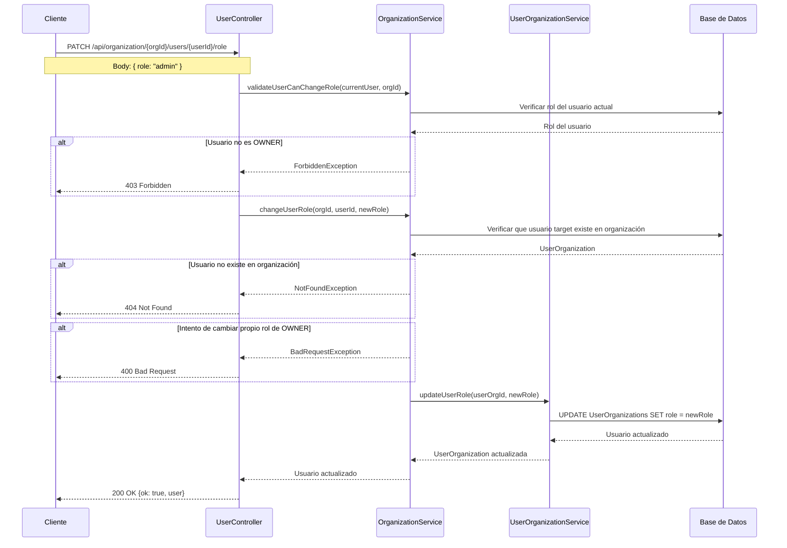

# Flujo de Gestión de Roles de Usuario en Organizaciones

Este documento describe el flujo para gestionar los roles de usuarios dentro de organizaciones en el backend de Sofia Chat.

## Diagrama de Flujo



## Endpoints

### Cambiar Rol de Usuario
- **Método**: `PATCH`
- **Ruta**: `/api/organization/:organizationId/users/:userId/role`
- **Permisos**: Solo `OWNER` de la organización
- **Body**: `{ role: OrganizationRoleType }`

### Obtener Usuarios de Organización
- **Método**: `GET` 
- **Ruta**: `/api/organization/:organizationId/users`
- **Permisos**: `OWNER`, `ADMIN`, `SUPERVISOR`

## Reglas de Negocio

### Validaciones de Permisos
1. **Solo OWNER** puede cambiar roles de otros usuarios
2. **OWNER no puede cambiar su propio rol** para evitar pérdida de control
3. Usuario debe pertenecer a la organización objetivo

### Roles Disponibles
- `USER`: Usuario básico (por defecto)
- `HITL`: Agente humano en el bucle
- `SUPERVISOR`: Supervisión de agentes
- `ADMIN`: Administrador de la organización
- `USR_TECNICO`: Usuario técnico con permisos especiales
- `ING_PREVENTA`: Ingeniero de preventa
- `OWNER`: Propietario de la organización

### Restricciones
1. No se puede asignar rol `OWNER` mediante este endpoint
2. Solo puede haber un `OWNER` por organización
3. El rol `USR_TECNICO` tiene permisos especiales globales

## Componentes Involucrados

### UserController
- **Responsabilidad**: Validación de entrada y manejo de respuestas HTTP
- **Archivo**: `src/modules/user/user.controller.ts`
- **Método**: `changeUserRole()`

### OrganizationService  
- **Responsabilidad**: Lógica de negocio y validaciones de permisos
- **Archivo**: `src/modules/organization/organization.service.ts`
- **Método**: `changeUserRole()`

### UserOrganizationService
- **Responsabilidad**: Operaciones CRUD en relación usuario-organización  
- **Archivo**: `src/modules/organization/UserOrganization.service.ts`
- **Método**: `updateUserRole()`

### DTOs
- **ChangeUserRoleDto**: Validación del nuevo rol
- **Archivo**: `src/modules/user/dto/change-user-role.dto.ts`

## Estructura de Datos

### Request Body
```typescript
{
  role: 'admin' | 'hitl' | 'supervisor' | 'user' | 'usr_tecnico' | 'ing_preventa'
}
```

### Response Success
```typescript
{
  ok: true,
  user: {
    id: number,
    email: string,
    role: OrganizationRoleType
  }
}
```

## Consideraciones de Seguridad

1. **Autorización**: Verificación estricta de permisos de OWNER
2. **Validación**: Rol debe ser válido según enum OrganizationRoleType
3. **Auditoria**: Los cambios de rol quedan registrados en el sistema
4. **Prevención**: No permitir escalación de privilegios no autorizada

## Casos de Error

- **403 Forbidden**: Usuario no es OWNER de la organización
- **404 Not Found**: Usuario objetivo no existe en la organización  
- **400 Bad Request**: Intento de cambiar propio rol de OWNER o rol inválido
- **409 Conflict**: Intento de asignar rol OWNER (no permitido por este endpoint)