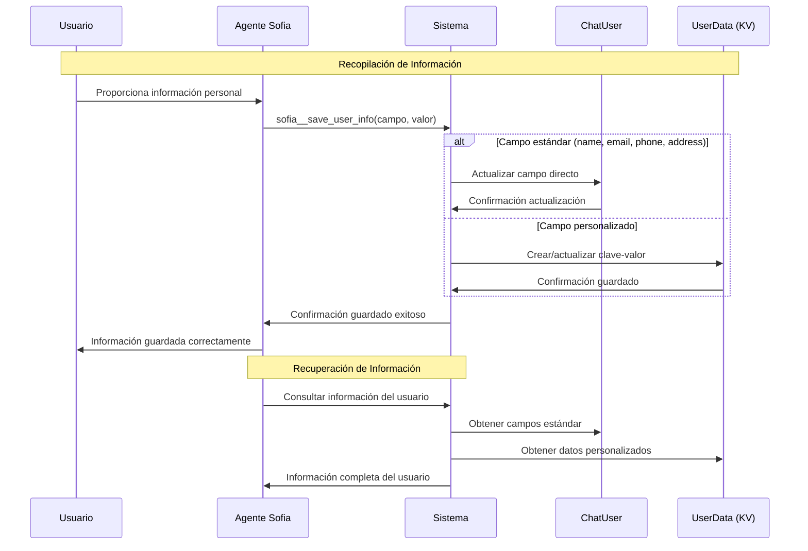

# Caso de Uso: Guardar Información del Usuario

## Descripción
Sistema que permite al agente recopilar y almacenar información personal del usuario durante las conversaciones. El agente puede guardar datos tanto en campos estándar (nombre, email, teléfono, dirección) como en un sistema de clave-valor para información personalizada. La información se guarda bajo la discreción del agente cuando el usuario la proporciona durante la conversación.

## Flujo Principal


```mermaid
sequenceDiagram
    participant User as Usuario
    participant Agent as Agente Sofia
    participant System as Sistema
    participant ChatUser as ChatUser
    participant UserData as UserData (KV)

    Note over User, UserData: Recopilación de Información
    User->>Agent: Proporciona información personal
    Agent->>System: sofia__save_user_info(campo, valor)
    
    alt Campo estándar (name, email, phone, address)
        System->>ChatUser: Actualizar campo directo
        ChatUser->>System: Confirmación actualización
    else Campo personalizado
        System->>UserData: Crear/actualizar clave-valor
        UserData->>System: Confirmación guardado
    end
    
    System->>Agent: Confirmación guardado exitoso
    Agent->>User: Información guardada correctamente
    
    Note over Agent, System: Recuperación de Información
    Agent->>System: Consultar información del usuario
    System->>ChatUser: Obtener campos estándar
    System->>UserData: Obtener datos personalizados
    System->>Agent: Información completa del usuario
```

## Componentes Involucrados

### Entidades
- **ChatUser**: Tabla existente con campos estándar
  - `name`: Nombre del usuario
  - `email`: Correo electrónico
  - `phone`: Número de teléfono
  - `address`: Dirección
  - `avatar`: URL del avatar (opcional)

- **ChatUserData**: Nueva tabla para datos clave-valor
  - `id`: Identificador único
  - `chat_user_id`: Referencia al ChatUser
  - `key`: Clave del dato (ej: "empresa", "edad", "preferencias")
  - `value`: Valor del dato
  - `created_at`: Fecha de creación
  - `updated_at`: Fecha de actualización

### Funciones del Agente
- **sofia__save_user_info**: Función para guardar información del usuario
  - Parámetros:
    - `campo`: string - Nombre del campo (ej: "name", "email", "empresa")
    - `valor`: string - Valor a guardar
  - Comportamiento:
    - Si el campo es estándar (name, email, phone, address): actualiza ChatUser
    - Si el campo es personalizado: crea/actualiza en ChatUserData
    - Valida formato de email si el campo es "email"
    - Normaliza el teléfono si el campo es "phone"

### Servicios
- **ChatUserService**: Servicio existente extendido
  - `updateUserInfo()`: Actualizar campos estándar
  - `saveCustomUserData()`: Guardar datos personalizados
  - `getUserCompleteInfo()`: Obtener información completa del usuario

- **ChatUserDataService**: Nuevo servicio para datos clave-valor
  - `createOrUpdate()`: Crear o actualizar dato personalizado
  - `findByUserAndKey()`: Buscar dato específico por clave
  - `findAllByUser()`: Obtener todos los datos del usuario

### Endpoints API
- **GET /api/chat-users/:id/info**: Obtener información completa del usuario
- **PUT /api/chat-users/:id/info**: Actualizar información del usuario (admin)

## Estructura de Datos

### ChatUser (Existente - Extendido)
```typescript
{
  id: number;
  name?: string;
  email?: string;
  phone?: string;
  address?: string;
  avatar?: string;
  // ... otros campos existentes
  customData?: ChatUserData[]; // Relación con datos personalizados
}
```

### ChatUserData (Nuevo)
```typescript
{
  id: number;
  chat_user_id: number;
  key: string;
  value: string;
  created_at: Date;
  updated_at: Date;
  chatUser: ChatUser;
}
```

### Función sofia__save_user_info
```typescript
{
  campo: string;  // Requerido - nombre del campo a guardar
  valor: string;  // Requerido - valor a almacenar
}
```

## Reglas de Negocio

1. **Discreción del Agente**: La información solo se guarda cuando el usuario la proporciona voluntariamente durante la conversación
2. **Campos Estándar**: name, email, phone, address se guardan directamente en ChatUser
3. **Campos Personalizados**: Cualquier otro campo se guarda en ChatUserData como clave-valor
4. **Validaciones**:
   - Email debe tener formato válido
   - Teléfono se normaliza automáticamente
   - Claves no pueden estar vacías
   - Valores se almacenan como string
5. **Actualización**: Si ya existe información, se actualiza con el nuevo valor
6. **Privacidad**: La información se asocia únicamente al ChatUser específico
7. **Opcional**: Todos los campos son opcionales, el usuario no está obligado a proporcionar información

### Validaciones Implementadas
- Formato de email válido para campo "email"
- Normalización de número telefónico para campo "phone"
- Sanitización de datos de entrada
- Verificación de existencia del ChatUser
- Límite de longitud para claves y valores

## Consideraciones Técnicas

### Archivos Nuevos
- **ChatUserData.entity.ts**: Nueva entidad para datos clave-valor
- **chat-user-data.service.ts**: Servicio para gestión de datos personalizados
- **chat-user-data.module.ts**: Módulo para datos personalizados

### Archivos Modificados
- **ChatUser.entity.ts**: Agregar relación OneToMany con ChatUserData
- **chat-user.service.ts**: Extender con métodos para información completa
- **function-call.service.ts**: Agregar función sofia__save_user_info
- **base-agent.ts**: Incluir definición de función para agentes
- **sofia-llm.service.ts**: Renderizado para OpenAI
- **claude-sonet.service.ts**: Renderizado para Anthropic

### Base de Datos
- **Nueva tabla**: chat_user_data
- **Migración**: Crear tabla con índices apropiados
- **Relaciones**: ChatUser OneToMany ChatUserData
- **Índices**: Índice compuesto en (chat_user_id, key) para búsquedas rápidas

### Dependencias
- **TypeORM**: Para nueva entidad y relaciones
- **class-validator**: Para validaciones de entrada
- **AgentModule**: Integración con sistema de funciones del agente

## Estado de Implementación

### 🔄 Por Implementar
- Entidad ChatUserData
- Servicio ChatUserDataService
- Extensión de ChatUserService
- Función sofia__save_user_info en FunctionCallService
- Migración de base de datos
- Integración con agentes (Sofia LLM y Claude)
- Endpoints API para consulta de información
- Validaciones y sanitización de datos
- Tests unitarios

### 🎯 Objetivo
Permitir que el agente recopile y almacene información del usuario de forma natural durante las conversaciones, mejorando la personalización y el contexto para futuras interacciones.