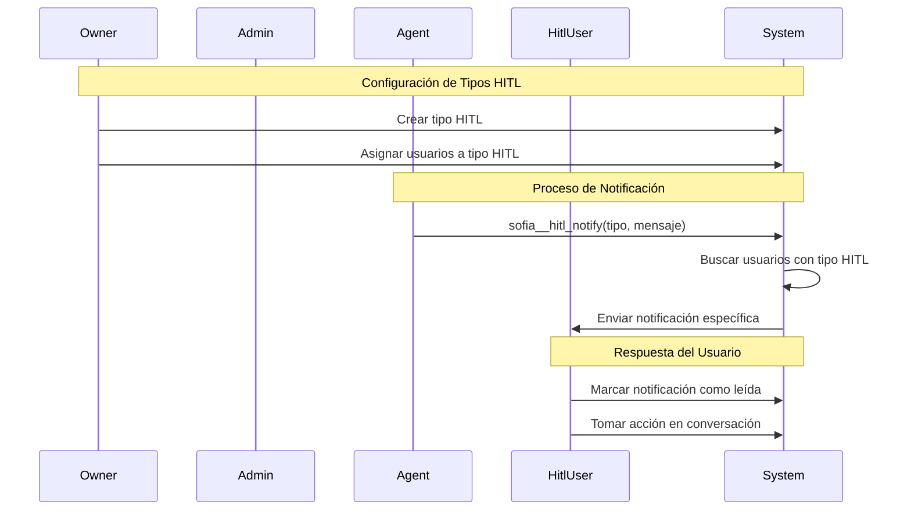

# Caso de Uso: Notificaciones HITL (Human In The Loop)

## Descripción
Sistema de notificaciones especializadas por tipo de HITL que permite al owner definir tipos específicos de intervención humana y asignar usuarios especializados para cada tipo. El agente puede invocar notificaciones dirigidas únicamente a usuarios con el tipo de HITL correspondiente.

## Flujo Principal



## Componentes Involucrados

### Entidades
- **HitlType**: Nueva tabla para tipos de HITL
  - `id`: Identificador único
  - `name`: Nombre del tipo (ej: "soporte_tecnico", "ventas_especializadas")
  - `description`: Descripción del tipo
  - `organization_id`: Organización propietaria
  - `created_by`: Usuario owner que creó el tipo

- **UserHitlType**: Nueva tabla relacional usuarios-tipos HITL
  - `id`: Identificador único
  - `user_id`: Usuario asignado
  - `hitl_type_id`: Tipo de HITL asignado
  - `organization_id`: Organización

### Funciones del Agente
- **sofia__hitl_notify**: Nueva función interna
  - Parámetros: `tipo_hitl`, `mensaje`, `conversacion_id`
  - Envía notificación solo a usuarios con el tipo específico
  - Valida que el tipo existe en la organización

### Endpoints API
- **POST /api/hitl-types**: Crear tipo HITL (solo OWNER)
- **GET /api/hitl-types**: Listar tipos de organización
- **PUT /api/hitl-types/:id**: Actualizar tipo HITL
- **DELETE /api/hitl-types/:id**: Eliminar tipo HITL
- **POST /api/hitl-types/:id/users**: Asignar usuarios a tipo
- **DELETE /api/hitl-types/:id/users/:userId**: Remover usuario de tipo

### Modificaciones al Sistema de Notificaciones
- **NotificationService.createHitlNotification()**: Nueva función
- **SocketService**: Envío de notificaciones por tipo HITL
- **NotificationController**: Endpoints para gestión HITL

## Estructura de Datos

### HitlType
```typescript
{
  id: number;
  name: string;
  description: string;
  organization_id: number;
  created_by: number;
  created_at: Date;
}
```

### UserHitlType
```typescript
{
  id: number;
  user_id: number;
  hitl_type_id: number;
  organization_id: number;
  assigned_at: Date;
}
```

### Función sofia__hitl_notify
```typescript
{
  tipo_hitl: string;
  mensaje: string;
  conversacion_id: number;
}
```

## Reglas de Negocio

1. **Permisos**: Solo usuarios con rol OWNER pueden crear y gestionar tipos HITL
2. **Validación**: Un usuario solo puede ser asignado a tipos HITL de su organización
3. **Notificaciones**: Solo usuarios HITL asignados al tipo específico reciben la notificación
4. **Rol Requerido**: El usuario debe tener rol HITL en la organización para ser asignado a tipos
5. **Unicidad**: Un usuario puede estar asignado a múltiples tipos HITL

## Consideraciones Técnicas

- **Archivos nuevos**: HitlType.entity.ts, UserHitlType.entity.ts
- **Módulo nuevo**: hitl-types.module.ts
- **Función interna**: Agregar a function-call.service.ts
- **Migraciones**: Nueva migración para tablas HitlType y UserHitlType
- **Validaciones**: Verificar rol HITL antes de asignación a tipos