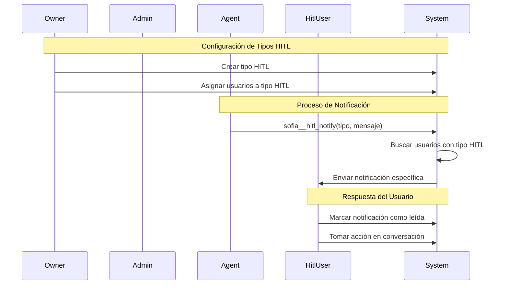

# Caso de Uso: Notificaciones HITL (Human In The Loop)

## Descripción
Sistema de notificaciones especializadas por tipo de HITL que permite al owner definir tipos específicos de intervención humana y asignar usuarios especializados para cada tipo. El agente puede invocar notificaciones dirigidas únicamente a usuarios con el tipo de HITL correspondiente.

## Flujo Principal



## Componentes Involucrados

### Entidades
- **HitlType**: Nueva tabla para tipos de HITL
  - `id`: Identificador único
  - `name`: Nombre del tipo (ej: "soporte_tecnico", "ventas_especializadas")
  - `description`: Descripción del tipo
  - `organization_id`: Organización propietaria
  - `created_by`: Usuario owner que creó el tipo

- **UserHitlType**: Nueva tabla relacional usuarios-tipos HITL
  - `id`: Identificador único
  - `user_id`: Usuario asignado
  - `hitl_type_id`: Tipo de HITL asignado
  - `organization_id`: Organización

### Funciones del Agente
- **sofia__hitl_notify**: Nueva función interna
  - Parámetros: `tipo_hitl`, `mensaje`, `conversacion_id`
  - Envía notificación solo a usuarios con el tipo específico
  - Valida que el tipo existe en la organización

### Endpoints API (Probados ✅)
- **POST /api/organizations/{orgId}/hitl-types**: Crear tipo HITL (solo OWNER)
- **GET /api/organizations/{orgId}/hitl-types**: Listar tipos de organización
- **GET /api/organizations/{orgId}/hitl-types/{id}**: Obtener tipo específico
- **PATCH /api/organizations/{orgId}/hitl-types/{id}**: Actualizar tipo HITL (solo OWNER)
- **DELETE /api/organizations/{orgId}/hitl-types/{id}**: Eliminar tipo HITL (solo OWNER)
- **POST /api/organizations/{orgId}/hitl-types/{id}/users**: Asignar usuarios a tipo (solo OWNER)
- **DELETE /api/organizations/{orgId}/hitl-types/{id}/users/{userId}**: Remover usuario de tipo (solo OWNER)

### Endpoints Relacionados
- **GET /api/user**: Obtener perfil completo con todas las userOrganizations
- **GET /api/user/all/{orgId}**: Obtener usuarios de organización (filtrar role === 'hitl' en frontend)
- **POST /api/auth/log-in**: Autenticación para obtener JWT token

### Modificaciones al Sistema de Notificaciones
- **NotificationService.createHitlNotification()**: Nueva función
- **SocketService**: Envío de notificaciones por tipo HITL
- **NotificationController**: Endpoints para gestión HITL

## Estructura de Datos

### HitlType
```typescript
{
  id: number;
  name: string;
  description: string;
  organization_id: number;
  created_by: number;
  created_at: Date;
  updated_at: Date;
  deleted_at: Date | null;
  creator: User;
  userHitlTypes: UserHitlType[];
}
```

### UserHitlType
```typescript
{
  id: number;
  user_id: number;
  hitl_type_id: number;
  organization_id: number;
  created_at: Date;
  updated_at: Date;
  deleted_at: Date | null;
  user: User;
}
```

### Función sofia__hitl_notify
```typescript
{
  tipo_hitl: string;
  mensaje: string;
  conversacion_id: number;
}
```

## Reglas de Negocio

1. **Permisos**: Solo usuarios con rol OWNER pueden crear y gestionar tipos HITL
2. **Validación**: Un usuario solo puede ser asignado a tipos HITL de su organización
3. **Notificaciones**: Solo usuarios HITL asignados al tipo específico reciben la notificación
4. **Rol Requerido**: El usuario debe tener rol HITL en la organización para ser asignado a tipos
5. **Unicidad**: Un usuario puede estar asignado a múltiples tipos HITL
6. **Verificación por Organización**: Todos los permisos se verifican específicamente por organización
7. **Acceso Granular**: El sistema valida acceso basado en el organizationId de la URL del endpoint

### Validaciones Implementadas
- Verificación de rol OWNER para gestión de tipos HITL
- Validación de pertenencia a organización específica
- Verificación de rol HITL antes de asignación
- Unicidad de nombres de tipos HITL por organización
- Eliminación en cascada de asignaciones al eliminar tipos

## Consideraciones Técnicas

### Archivos Modificados
- **HitlType.entity.ts**: Nueva entidad para tipos HITL
- **UserHitlType.entity.ts**: Nueva entidad relacional usuarios-tipos
- **UserOrganization.entity.ts**: Agregado campo organizationId explícito
- **hitl-types.module.ts**: Nuevo módulo con controller y service
- **function-call.service.ts**: Función sofia__hitl_notify implementada
- **user.service.ts**: Método findById corregido para retornar todas las organizaciones
- **jwt-auth-roles.guard.ts**: Verificación de permisos por organización específica
- **get-organization.decorator.ts**: ParseInt corregido para extraer organizationId

### Base de Datos
- **Tablas nuevas**: hitl_types, user_hitl_types
- **Migraciones**: Ejecutadas automáticamente
- **Relaciones**: UserOrganizations contiene organizationId directo

### Dependencias
- **AuthModule**: Importado en HitlTypesModule para JWT guards
- **HitlTypesModule**: Importado en FunctionCallModule para función del agente
- **TypeORM**: Configurado con relaciones y validaciones apropiadas

## Estado de Implementación

### ✅ Completado y Probado
- Todas las entidades y relaciones
- Todos los endpoints CRUD funcionando
- Validaciones de permisos (solo OWNER puede gestionar)
- Asignación y remoción de usuarios HITL
- Función sofia__hitl_notify implementada
- Sistema de notificaciones integrado
- Verificación de permisos por organización específica

### 🔧 Correcciones Críticas Realizadas
- **UserService.findById()**: Removido select específico para retornar todas las userOrganizations del usuario
- **GetOrganization decorator**: Corregido parseInt(organizationId, 10) en lugar de parseInt(organizationId, -1)
- **JwtAuthRolesGuard**: Implementada verificación de roles por organización específica extraída de URL
- **UserOrganization.entity**: Agregado campo organizationId explícito para compatibilidad
- **Módulos**: HitlTypesModule correctamente importado en FunctionCallModule y AuthModule

### 🔍 Problemas Identificados y Resueltos
1. **Bucle infinito en frontend**: UserService retornaba solo 1 organización por problemas en select
2. **Permisos incorrectos**: Guard verificaba roles globalmente en lugar de por organización
3. **ParseInt malformado**: Decorador causaba NaN por radix inválido
4. **Relaciones incompletas**: Select limitaba la carga completa de userOrganizations