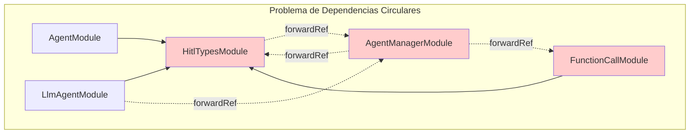
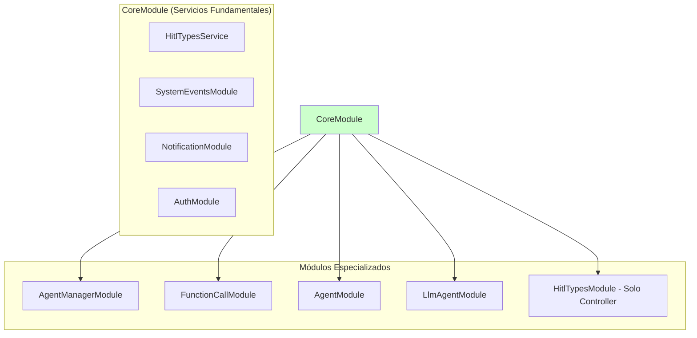

# Caso de Uso: Resolución de Dependencias Circulares

## Descripción
Reestructuración del sistema de módulos para eliminar las dependencias circulares que existían entre HitlTypesModule, AgentManagerModule, FunctionCallModule y otros módulos relacionados, mediante la creación de un CoreModule centralizado.

## Problema Original

### Dependencias Circulares Identificadas


### Síntomas del Problema
- Referencias circulares entre módulos usando `forwardRef()`
- Múltiples módulos dependiendo del mismo servicio (HitlTypesService)
- Dificultad para mantener y escalar la arquitectura
- Riesgo de errores de inicialización en tiempo de ejecución

## Solución Implementada

### Nueva Arquitectura con CoreModule


## Componentes Involucrados

### CoreModule (Nuevo)
- **Ubicación**: `src/modules/core/core.module.ts`
- **Responsabilidad**: Centralizar servicios fundamentales compartidos
- **Servicios incluidos**:
  - HitlTypesService
  - SystemEventsModule
  - NotificationModule  
  - AuthModule
- **Importaciones**: TypeORM entities para HitlType, UserHitlType, User

### Módulos Refactorizados

#### HitlTypesModule
- **Antes**: Contenía servicio y controlador
- **Después**: Solo controlador, importa CoreModule
- **Beneficio**: Eliminada dependencia circular con AgentManagerModule

#### AgentManagerModule
- **Cambios**: Removido forwardRef a HitlTypesModule, ahora importa CoreModule
- **Servicios**: Mantiene AgentManagerService intacto

#### FunctionCallModule  
- **Cambios**: Removidas importaciones redundantes, usa CoreModule
- **Servicios**: FunctionCallService mantiene funcionalidad HITL

#### AgentModule
- **Cambios**: Importa CoreModule en lugar de múltiples módulos individuales
- **Servicios**: AgentService y FunctionCallService sin cambios

#### LlmAgentModule
- **Cambios**: Simplificado, usa CoreModule para dependencias base
- **Controlador**: LlmAgentController mantiene toda su funcionalidad

## Estructura de Archivos

### Archivos Nuevos
```
src/modules/core/
└── core.module.ts
```

### Archivos Modificados
```
src/modules/hitl-types/hitl-types.module.ts
src/modules/agent-manager/agent-manager.module.ts
src/modules/function-call/function-call.module.ts
src/modules/agent/agent.module.ts
src/modules/llm-agent/llm-agent.module.ts
src/app.module.ts
```

## Beneficios de la Solución

### 1. Eliminación de Referencias Circulares
- Arquitectura lineal y predecible
- No más `forwardRef()` entre módulos core
- Inicialización determinística de módulos

### 2. Separación de Responsabilidades
- **CoreModule**: Servicios fundamentales compartidos
- **Módulos especializados**: Lógica específica de dominio
- **Controladores**: Solo responsables de endpoints API

### 3. Mantenibilidad Mejorada
- Dependencias claras y unidireccionales
- Fácil identificación de servicios compartidos
- Escalabilidad sin conflictos de dependencias

### 4. Compatibilidad Preservada
- Toda la funcionalidad HITL mantenida
- APIs sin cambios
- BaseAgent sigue funcionando con HitlTypesService

## Validaciones Implementadas

### ✅ Compilación
- `npm run build` - Sin errores
- `npm run lint` - Sin warnings de dependencias circulares

### ✅ Inicialización
- Aplicación inicia correctamente
- Todos los módulos se cargan sin errores
- WebSocket Gateway funcionando

### ✅ Funcionalidad
- Endpoints HITL operativos
- Servicios de agente funcionando
- Function calls manteniendo lógica HITL

## Reglas de Arquitectura Establecidas

### 1. CoreModule como Base
- Servicios fundamentales van en CoreModule
- Otros módulos importan CoreModule, no servicios individuales
- No dependencias circulares permitidas

### 2. Módulos Especializados
- Un módulo por responsabilidad específica
- Importan CoreModule para servicios base
- Controladores separados de servicios cuando es necesario

### 3. Servicios Compartidos
- Si un servicio es usado por 3+ módulos → CoreModule
- Servicios específicos permanecen en sus módulos
- Inyección de dependencias clara y lineal

## Consideraciones Futuras

### Escalabilidad
- Nuevos servicios fundamentales → CoreModule
- Servicios específicos → Módulos especializados
- Mantener principio de responsabilidad única

### Monitoreo
- Evitar re-introducir dependencias circulares
- Validar arquitectura en cada PR
- Documentar cambios de dependencias

## Estado de Implementación

### ✅ Completado
- CoreModule creado y configurado
- Todos los módulos refactorizados
- Dependencias circulares eliminadas
- Aplicación funcionando correctamente
- Tests de compilación pasando

### 🔧 Archivos Actualizados
- `src/modules/core/core.module.ts` (Nuevo)
- `src/modules/hitl-types/hitl-types.module.ts` (Simplificado)
- `src/modules/agent-manager/agent-manager.module.ts` (Refactorizado)
- `src/modules/function-call/function-call.module.ts` (Refactorizado)  
- `src/modules/agent/agent.module.ts` (Refactorizado)
- `src/modules/llm-agent/llm-agent.module.ts` (Refactorizado)
- `src/app.module.ts` (CoreModule añadido)

### 🎯 Resultado
- ✅ Dependencias circulares eliminadas
- ✅ Funcionalidad HITL preservada
- ✅ Arquitectura más limpia y mantenible
- ✅ Base sólida para futuras expansiones