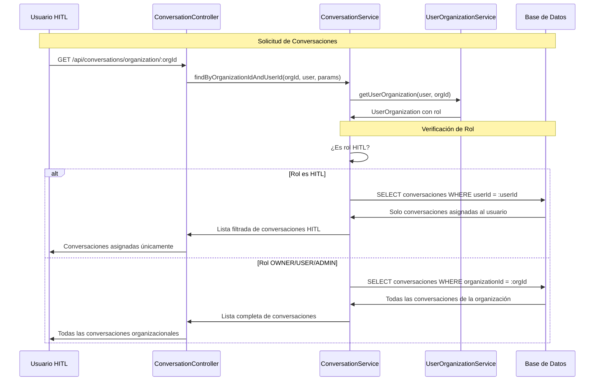

# Caso de Uso: Restricciones de Conversaciones para Rol HITL

## Descripción
Sistema de restricciones que filtra las conversaciones que puede ver un usuario con rol HITL en el endpoint `/api/conversations/organization/:organizationId`. Los usuarios HITL solo pueden ver conversaciones que tienen asignadas específicamente a ellos, mientras que otros roles (OWNER, USER) pueden ver todas las conversaciones de la organización.

## Flujo Principal



## Componentes Involucrados

### Controlador
- **ConversationController**: Endpoint existente mantenido
  - Ruta: `GET /api/conversations/organization/:organizationId`
  - Decorador: `@Roles(OrganizationRoleType.HITL, OrganizationRoleType.OWNER, OrganizationRoleType.USER)`
  - Utiliza `@GetUser()` para obtener usuario completo
  - Llama a `findByOrganizationIdAndUserId()` sin cambios

### Servicios
- **ConversationService**: Lógica de restricciones implementada
  - `findByOrganizationIdAndUserId()`: Método modificado con filtro por rol
  - Verificación de rol HITL antes de aplicar restricciones
  - Mantiene funcionalidad existente para otros roles

- **UserOrganizationService**: Obtención de rol del usuario
  - `getUserOrganization()`: Método existente utilizado para verificar rol

### Entidades
- **Conversation**: Conversaciones con campo `userId` para asignación
- **UserOrganization**: Relación usuario-organización con rol específico
- **User**: Usuario autenticado con relaciones

## Estructura de Datos

### Restricción de Query por Rol
```typescript
// Para rol HITL
queryBuilder.andWhere('c."userId" = :userId', { userId: user.id });

// Para otros roles (sin restricción adicional)
// Solo filtro por organización existente
```

### Verificación de Rol
```typescript
if (userOrganization.role === OrganizationRoleType.HITL) {
  // Aplicar restricción específica
  queryBuilder.andWhere('c."userId" = :userId', { userId: user.id });
}
// Otros roles mantienen comportamiento original
```

## Reglas de Negocio

1. **Verificación de Pertenencia**: Usuario debe pertenecer a la organización
2. **Rol HITL Restringido**: Solo ve conversaciones donde `conversation.userId = user.id`
3. **Otros Roles Sin Restricción**: OWNER, ADMIN, USER ven todas las conversaciones organizacionales
4. **Filtros de Búsqueda**: Todos los filtros de SearchConversationDto se mantienen funcionales
5. **Conversaciones Asignadas**: Solo conversaciones con `userId` específico para HITL

### Comportamiento por Rol

#### HITL
- Solo conversaciones asignadas específicamente (`conversation.userId = user.id`)
- No ve conversaciones sin asignar o asignadas a otros usuarios
- Ideal para especialistas que solo deben atender sus casos

#### OWNER/ADMIN/USER
- Todas las conversaciones de la organización
- Sin restricciones adicionales de asignación
- Comportamiento original mantenido

## Consideraciones Técnicas

### Archivos Modificados
- **conversation.service.ts**: Agregada verificación de rol HITL
- **Importaciones**: Agregado `OrganizationRoleType` para comparación tipo-segura

### Query Builder
- Utiliza `andWhere()` para agregar condición sin afectar filtros existentes
- Mantiene todos los JOIN y selecciones del query original
- Preserva funcionalidad de búsqueda por parámetros

### Compatibilidad
- No afecta comportamiento para roles no-HITL
- Mantiene todos los filtros de búsqueda existentes
- Implementación no invasiva que extiende funcionalidad

### Performance
- Condición adicional simple en WHERE clause
- Utiliza índice existente en `userId`
- No impacto significativo en rendimiento

## Estado de Implementación

### ✅ Completado
- Modificación de `findByOrganizationIdAndUserId()` con restricción HITL
- Verificación de rol usando `OrganizationRoleType.HITL`
- Preservación de funcionalidad para otros roles
- Mantenimiento de filtros de búsqueda existentes
- Importación correcta de tipos y enums

### 🎯 Objetivo
Asegurar que usuarios con rol HITL solo puedan ver y gestionar las conversaciones que tienen asignadas específicamente, manteniendo la separación de responsabilidades y la seguridad de datos entre especialistas.

### 📋 Casos de Uso Cubiertos
1. **HITL especializado**: Solo ve conversaciones asignadas a él
2. **Administradores**: Mantienen visibilidad completa
3. **Usuarios regulares**: Sin cambios en funcionalidad
4. **Búsquedas filtradas**: Todos los parámetros de búsqueda funcionan correctamente