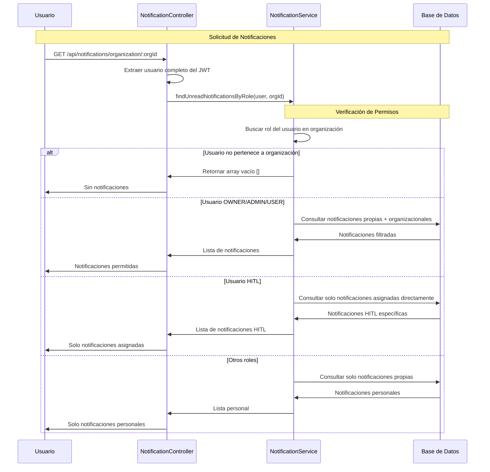

# Caso de Uso: Restricciones de Notificaciones por Rol

## Descripción
Sistema de restricciones que controla qué notificaciones puede ver cada usuario según su rol dentro de la organización. Implementa un sistema de permisos granular que filtra las notificaciones del endpoint `/api/notifications/organization/:organizationId` basado en el rol del usuario.

## Flujo Principal



## Componentes Involucrados

### Controlador
- **NotificationController**: Endpoint modificado
  - Ruta: `GET /api/notifications/organization/:organizationId`
  - Utiliza `@GetUser()` decorator para obtener usuario completo
  - Llama a `findUnreadNotificationsByRole()` en lugar de método anterior

### Servicios
- **NotificationService**: Lógica de restricciones
  - `findUnreadNotificationsByRole()`: Nuevo método con restricciones por rol
  - `findUnreadNotifications()`: Método legacy mantenido para compatibilidad

### Entidades
- **User**: Usuario autenticado con relaciones userOrganizations
- **UserOrganization**: Relación usuario-organización con rol específico  
- **Notification**: Notificaciones del sistema con metadatos

## Estructura de Datos

### Restricciones por Rol
```typescript
{
  OWNER: 'Notificaciones propias + organizacionales',
  ADMIN: 'Notificaciones propias + organizacionales',  
  USER: 'Notificaciones propias + organizacionales',
  HITL: 'Solo notificaciones asignadas directamente',
  otros: 'Solo notificaciones personales'
}
```

### Query de Notificaciones por Rol
```typescript
// OWNER/ADMIN/USER
'(notification.userId = :userId OR (notification.userId IS NULL AND notification.organizationId = :organizationId))'

// HITL y otros roles
'notification.userId = :userId'
```

## Reglas de Negocio

1. **Verificación de Pertenencia**: Usuario debe pertenecer a la organización para ver notificaciones
2. **Roles Privilegiados**: OWNER, ADMIN y USER pueden ver notificaciones organizacionales
3. **Rol HITL Restringido**: Solo ve notificaciones asignadas específicamente a él
4. **Otros Roles**: Solo ven sus notificaciones personales
5. **Filtro Base**: Solo notificaciones UNREAD ordenadas por fecha descendente
6. **Sin Organización**: Si usuario no pertenece a organización, retorna array vacío

### Comportamiento por Rol

#### OWNER/ADMIN/USER
- Notificaciones personales (notification.userId = userId)
- Notificaciones del sistema para la organización (notification.userId IS NULL)
- Acceso completo a notificaciones organizacionales

#### HITL
- Solo notificaciones asignadas directamente (notification.userId = userId)
- No ve notificaciones generales de la organización
- Ideal para usuarios que solo deben ver conversaciones asignadas

#### Otros Roles
- Solo notificaciones personales
- Sin acceso a notificaciones organizacionales
- Comportamiento más restrictivo por defecto

## Consideraciones Técnicas

### Archivos Modificados
- **notification.controller.ts**: Cambio en endpoint para usar `@GetUser()` decorator
- **notification.service.ts**: Nuevo método `findUnreadNotificationsByRole()`
- **notification.module.ts**: Mantiene importaciones existentes

### Query Builder
- Utiliza TypeORM QueryBuilder para queries dinámicas
- Aplicación de filtros condicionales según rol
- Ordenamiento por fecha de creación descendente
- Status UNREAD como filtro base

### Compatibilidad
- Método `findUnreadNotifications()` mantenido para retrocompatibilidad
- No afecta otros endpoints del controlador
- Implementación no invasiva que extiende funcionalidad existente

### Seguridad
- Verificación de pertenencia a organización antes de mostrar notificaciones
- Filtrado basado en rol específico del usuario en la organización
- No exposición de notificaciones de organizaciones no autorizadas

## Estado de Implementación

### ✅ Completado
- Modificación del endpoint `/api/notifications/organization/:organizationId`
- Implementación de `findUnreadNotificationsByRole()` con restricciones por rol
- Verificación de pertenencia a organización
- Filtrado específico para roles OWNER, ADMIN, USER, HITL
- Mantenimiento de compatibilidad con método legacy
- Uso correcto del decorator `@GetUser()` para obtener usuario completo

### 🎯 Objetivo
Implementar un sistema de notificaciones con permisos granulares que respete la jerarquía y responsabilidades de cada rol dentro de la organización, asegurando que cada usuario solo vea las notificaciones relevantes a su función.

### 📋 Casos de Uso Cubiertos
1. **Administradores**: Ven todas las notificaciones organizacionales
2. **Usuarios HITL**: Solo ven conversaciones asignadas específicamente  
3. **Usuarios regulares**: Ven notificaciones propias y organizacionales
4. **No miembros**: No ven notificaciones de organizaciones ajenas