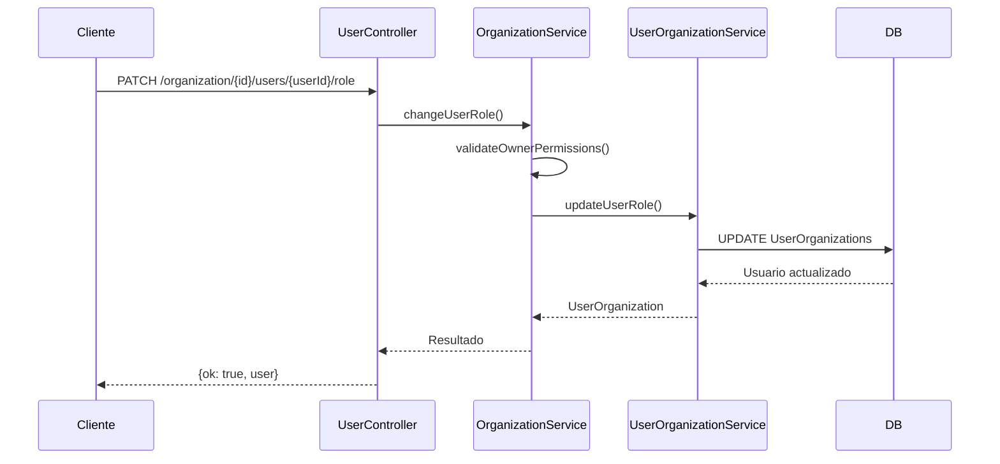

# Resumen de Implementación - Gestión de Roles de Usuario

## ✅ Funcionalidad Implementada

Se ha implementado exitosamente la funcionalidad para **editar el tipo de usuario (rol) de una organización** siguiendo las reglas arquitecturales del proyecto.

## 📁 Archivos Creados/Modificados

### Nuevos Archivos
1. **`docu/flujo-gestion-roles-usuario.md`** - Documentación del caso de uso
2. **`docu/ejemplos-gestion-roles.md`** - Ejemplos prácticos de uso
3. **`src/modules/user/change-user-role.dto.ts`** - DTO para validación del nuevo rol

### Archivos Modificados
1. **`src/modules/organization/UserOrganization.service.ts`** - Agregado método `updateUserRole()`
2. **`src/modules/organization/organization.service.ts`** - Agregado método `changeUserRole()`
3. **`src/modules/user/user.controller.ts`** - Agregados endpoints para gestión de roles
4. **`src/modules/user/user.service.ts`** - Agregado método `getUsersByOrganizationId()`
5. **`src/modules/user/user.module.ts`** - Configuración de entidades

## 🚀 Endpoints Disponibles

### 1. Obtener Usuarios de Organización
```
GET /api/user/organization/:organizationId/users
```
- **Permisos**: OWNER, ADMIN, SUPERVISOR
- **Respuesta**: Lista de usuarios con sus roles

### 2. Cambiar Rol de Usuario
```
PATCH /api/user/organization/:organizationId/users/:userId/role
```
- **Permisos**: Solo OWNER
- **Body**: `{ "role": "admin" }`
- **Respuesta**: Usuario con rol actualizado

## 🔐 Validaciones de Seguridad

1. **Solo OWNER puede cambiar roles** - Verificación estricta de permisos
2. **Autoprotección de OWNER** - No puede cambiar su propio rol
3. **Restricción de asignación de OWNER** - Solo mediante endpoints específicos
4. **Validación de existencia** - Usuario debe pertenecer a la organización
5. **Validación de roles** - Solo roles válidos según enum

## 📝 Roles Soportados

| Rol | Descripción |
|-----|-------------|
| `user` | Usuario básico (por defecto) |
| `hitl` | Agente humano en el bucle |
| `supervisor` | Supervisión de agentes |
| `admin` | Administrador de organización |
| `usr_tecnico` | Usuario técnico especial |
| `ing_preventa` | Ingeniero de preventa |
| ~~`owner`~~ | *No asignable por este endpoint* |

## 🧪 Ejemplo de Uso

```bash
# 1. Listar usuarios de organización
curl -X GET "http://localhost:3001/api/user/organization/5/users" \
  -H "Authorization: Bearer YOUR_TOKEN"

# 2. Cambiar usuario a administrador
curl -X PATCH "http://localhost:3001/api/user/organization/5/users/10/role" \
  -H "Authorization: Bearer YOUR_TOKEN" \
  -H "Content-Type: application/json" \
  -d '{"role": "admin"}'
```

## ✨ Características Técnicas

- **Tipado fuerte**: Uso de enums para roles
- **Programación funcional**: Métodos puros sin efectos secundarios
- **Validaciones robustas**: DTOs con decoradores de validación
- **Arquitectura modular**: Separación clara de responsabilidades
- **Manejo de errores**: Excepciones específicas para cada caso

## 🔄 Flujo de Ejecución



## 📊 Estado del Proyecto

- ✅ **Compilación**: Sin errores
- ✅ **Tipado**: TypeScript estricto
- ✅ **Validaciones**: DTOs configurados
- ✅ **Documentación**: Casos de uso documentados
- ✅ **Ejemplos**: Comandos cURL listos para pruebas

## 🎯 Siguientes Pasos

1. **Pruebas**: Ejecutar tests de integración
2. **Frontend**: Implementar interfaz de gestión de roles
3. **Auditoría**: Agregar logs de cambios de roles
4. **Notificaciones**: Enviar emails cuando cambie un rol

## 📋 Consideraciones

- La funcionalidad respeta todas las reglas arquitecturales del proyecto
- Mantiene compatibilidad con endpoints existentes
- No altera inputs/outputs de funciones existentes
- Sigue patrones de diseño establecidos en el proyecto